<!-- GENERATED:MODEL -->
---
tags: [odoo, community, generated, model]
---

# payment.capture.wizard

- Module: [[docs/Community Addons/payment/payment|payment]]
- Scope: Community Addons
- Defined in module: yes
- Source files: `wizards/payment_capture_wizard.py`
- Python classes: `PaymentCaptureWizard`
- Description: Payment Capture Wizard

## Field footprint

- Detected fields: 12
- Field types: `Boolean` x 5, `Many2many` x 1, `Many2one` x 1, `Monetary` x 5
- Relation fields: 2

## Sample fields

- `amount_to_capture`: `Monetary` (compute `_compute_amount_to_capture`, store `True`)
- `authorized_amount`: `Monetary` (compute `_compute_authorized_amount`)
- `available_amount`: `Monetary` (compute `_compute_available_amount`)
- `captured_amount`: `Monetary` (compute `_compute_captured_amount`)
- `currency_id`: `Many2one` (related `transaction_ids.currency_id`)
- `has_draft_children`: `Boolean` (compute `_compute_has_draft_children`)
- `has_remaining_amount`: `Boolean` (compute `_compute_has_remaining_amount`)
- `is_amount_to_capture_valid`: `Boolean` (compute `_compute_is_amount_to_capture_valid`)
- `support_partial_capture`: `Boolean` (compute `_compute_support_partial_capture`)
- `transaction_ids`: `Many2many` (comodel `payment.transaction`)
- `void_remaining_amount`: `Boolean`
- `voided_amount`: `Monetary` (compute `_compute_voided_amount`)

## Method hints

- Detected methods: 11
- Action methods: `action_capture`
- Compute methods: `_compute_amount_to_capture`, `_compute_authorized_amount`, `_compute_available_amount`, `_compute_captured_amount`, `_compute_has_draft_children`, `_compute_has_remaining_amount`, `_compute_is_amount_to_capture_valid`, `_compute_support_partial_capture`, and 1 more
- Onchange methods: none

## Direct relation diagram

```plantuml
@startuml
!define ODOO_COLOR_PRIMARY #714B67
!define ODOO_COLOR_ACCENT #875A7B
!define ODOO_COLOR_BG #FAF7FA

skinparam backgroundColor ODOO_COLOR_BG
skinparam defaultTextAlignment left
skinparam ArrowColor ODOO_COLOR_ACCENT
skinparam ClassBackgroundColor white
skinparam ClassBorderColor ODOO_COLOR_PRIMARY
skinparam ComponentBackgroundColor white
skinparam ComponentBorderColor ODOO_COLOR_PRIMARY
skinparam NoteBackgroundColor #FFF8FF
skinparam NoteBorderColor ODOO_COLOR_ACCENT
skinparam SequenceLifeLineBorderColor ODOO_COLOR_ACCENT
skinparam SequenceLifeLineBackgroundColor #FFFFFF
skinparam SequenceParticipantBorderColor ODOO_COLOR_PRIMARY
skinparam SequenceParticipantBackgroundColor #FFFFFF
skinparam sequence {
  ArrowColor ODOO_COLOR_ACCENT
  ActorBorderColor ODOO_COLOR_PRIMARY
}
title payment.capture.wizard - Direct Relations
class "payment.capture.wizard" as payment_capture_wizard
class "payment.transaction" as payment_transaction
payment_capture_wizard .. payment_transaction : transaction_ids
@enduml
```

## Navigation

- **Parent:** [[docs/Community Addons/payment/Models]]

<!-- GENERATED:MODEL -->
