<!-- GENERATED:MODEL -->
---
tags: [odoo, community, generated, model]
---

# payment.link.wizard

- Module: [[docs/Community Addons/payment/payment|payment]]
- Scope: Community Addons
- Defined in module: yes
- Source files: `wizards/payment_link_wizard.py`
- Python classes: `PaymentLinkWizard`
- Description: Generate Payment Link

## Field footprint

- Detected fields: 10
- Field types: `Char` x 4, `Integer` x 1, `Many2one` x 3, `Monetary` x 2
- Relation fields: 3

## Sample fields

- `amount`: `Monetary`
- `amount_max`: `Monetary`
- `company_id`: `Many2one` (comodel `res.company`, compute `_compute_company_id`)
- `currency_id`: `Many2one` (comodel `res.currency`)
- `link`: `Char` (compute `_compute_link`)
- `partner_email`: `Char` (related `partner_id.email`)
- `partner_id`: `Many2one` (comodel `res.partner`)
- `res_id`: `Integer` (comodel `Related Document ID`)
- `res_model`: `Char` (comodel `Related Document Model`)
- `warning_message`: `Char` (compute `_compute_warning_message`)

## Method hints

- Detected methods: 8
- Action methods: none
- Compute methods: `_compute_company_id`, `_compute_link`, `_compute_warning_message`
- Onchange methods: none

## Direct relation diagram

```plantuml
@startuml
!define ODOO_COLOR_PRIMARY #714B67
!define ODOO_COLOR_ACCENT #875A7B
!define ODOO_COLOR_BG #FAF7FA

skinparam backgroundColor ODOO_COLOR_BG
skinparam defaultTextAlignment left
skinparam ArrowColor ODOO_COLOR_ACCENT
skinparam ClassBackgroundColor white
skinparam ClassBorderColor ODOO_COLOR_PRIMARY
skinparam ComponentBackgroundColor white
skinparam ComponentBorderColor ODOO_COLOR_PRIMARY
skinparam NoteBackgroundColor #FFF8FF
skinparam NoteBorderColor ODOO_COLOR_ACCENT
skinparam SequenceLifeLineBorderColor ODOO_COLOR_ACCENT
skinparam SequenceLifeLineBackgroundColor #FFFFFF
skinparam SequenceParticipantBorderColor ODOO_COLOR_PRIMARY
skinparam SequenceParticipantBackgroundColor #FFFFFF
skinparam sequence {
  ArrowColor ODOO_COLOR_ACCENT
  ActorBorderColor ODOO_COLOR_PRIMARY
}
title payment.link.wizard - Direct Relations
class "payment.link.wizard" as payment_link_wizard
class "res.company" as res_company
class "res.currency" as res_currency
class "res.partner" as res_partner
payment_link_wizard --> res_currency : currency_id
payment_link_wizard --> res_partner : partner_id
payment_link_wizard --> res_company : company_id
@enduml
```

## Navigation

- **Parent:** [[docs/Community Addons/payment/Models]]

<!-- GENERATED:MODEL -->
