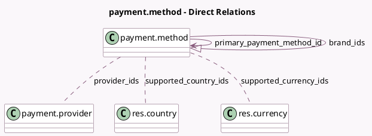

<!-- GENERATED:MODEL -->
---
tags: [odoo, community, generated, model]
---

# payment.method

- Module: [[docs/Community Addons/payment/payment|payment]]
- Scope: Community Addons
- Defined in module: yes
- Source files: `models/payment_method.py`
- Python classes: `PaymentMethod`
- Description: Payment Method

## Field footprint

- Detected fields: 16
- Field types: `Boolean` x 4, `Char` x 2, `Image` x 2, `Integer` x 1, `Many2many` x 3, `Many2one` x 1, `One2many` x 1, `Selection` x 2
- Relation fields: 5

## Sample fields

- `active`: `Boolean`
- `brand_ids`: `One2many` (comodel `payment.method`)
- `code`: `Char`
- `image`: `Image`
- `image_payment_form`: `Image` (related `image`, store `True`)
- `is_primary`: `Boolean` (compute `_compute_is_primary`)
- `name`: `Char`
- `primary_payment_method_id`: `Many2one` (comodel `payment.method`)
- `provider_ids`: `Many2many` (comodel `payment.provider`)
- `sequence`: `Integer`
- `support_express_checkout`: `Boolean`
- `support_manual_capture`: `Selection`
- `support_refund`: `Selection`
- `support_tokenization`: `Boolean`
- `supported_country_ids`: `Many2many` (comodel `res.country`)
- `supported_currency_ids`: `Many2many` (comodel `res.currency`)

## Method hints

- Detected methods: 9
- Action methods: none
- Compute methods: `_compute_is_primary`
- Onchange methods: `_onchange_provider_ids_warn_before_attaching_payment_method`, `_onchange_warn_before_disabling_tokens`

## Direct relation diagram

## Navigation

- **Parent:** [[docs/Community Addons/payment/Models]]

<!-- GENERATED:MODEL -->
