<!-- GENERATED:MODEL -->
---
tags: [odoo, community, generated, model]
---

# payment.provider

- Module: [[docs/Community Addons/payment/payment|payment]]
- Scope: Community Addons
- Defined in module: yes
- Source files: `models/payment_provider.py`
- Python classes: `PaymentProvider`
- Description: Payment Provider

## Field footprint

- Detected fields: 32
- Field types: `Boolean` x 7, `Char` x 1, `Html` x 5, `Image` x 1, `Integer` x 2, `Many2many` x 3, `Many2one` x 7, `Monetary` x 1, `Selection` x 5
- Relation fields: 10

## Sample fields

- `allow_express_checkout`: `Boolean`
- `allow_tokenization`: `Boolean`
- `auth_msg`: `Html`
- `available_country_ids`: `Many2many` (comodel `res.country`)
- `available_currency_ids`: `Many2many` (comodel `res.currency`, compute `_compute_available_currency_ids`, store `True`)
- `cancel_msg`: `Html`
- `capture_manually`: `Boolean`
- `code`: `Selection`
- `color`: `Integer` (compute `_compute_color`, store `True`)
- `company_id`: `Many2one` (comodel `res.company`)
- `done_msg`: `Html`
- `express_checkout_form_view_id`: `Many2one` (comodel `ir.ui.view`)
- `image_128`: `Image`
- `inline_form_view_id`: `Many2one` (comodel `ir.ui.view`)
- `is_published`: `Boolean`
- `main_currency_id`: `Many2one` (related `company_id.currency_id`)
- `maximum_amount`: `Monetary`
- `module_id`: `Many2one` (comodel `ir.module.module`)
- `module_state`: `Selection` (related `module_id.state`)
- `module_to_buy`: `Boolean` (related `module_id.to_buy`)

## Method hints

- Detected methods: 45
- Action methods: `action_reset_credentials`, `action_start_onboarding`, `action_toggle_is_published`, `action_view_payment_methods`
- Compute methods: `_compute_available_currency_ids`, `_compute_color`, `_compute_feature_support_fields`
- Onchange methods: `_onchange_company_block_if_existing_transactions`, `_onchange_state_switch_is_published`, `_onchange_state_warn_before_disabling_tokens`

## Direct relation diagram

```plantuml
@startuml
!define ODOO_COLOR_PRIMARY #714B67
!define ODOO_COLOR_ACCENT #875A7B
!define ODOO_COLOR_BG #FAF7FA

skinparam backgroundColor ODOO_COLOR_BG
skinparam defaultTextAlignment left
skinparam ArrowColor ODOO_COLOR_ACCENT
skinparam ClassBackgroundColor white
skinparam ClassBorderColor ODOO_COLOR_PRIMARY
skinparam ComponentBackgroundColor white
skinparam ComponentBorderColor ODOO_COLOR_PRIMARY
skinparam NoteBackgroundColor #FFF8FF
skinparam NoteBorderColor ODOO_COLOR_ACCENT
skinparam SequenceLifeLineBorderColor ODOO_COLOR_ACCENT
skinparam SequenceLifeLineBackgroundColor #FFFFFF
skinparam SequenceParticipantBorderColor ODOO_COLOR_PRIMARY
skinparam SequenceParticipantBackgroundColor #FFFFFF
skinparam sequence {
  ArrowColor ODOO_COLOR_ACCENT
  ActorBorderColor ODOO_COLOR_PRIMARY
}
title payment.provider - Direct Relations
class "payment.provider" as payment_provider
class "ir.module.module" as ir_module_module
class "ir.ui.view" as ir_ui_view
class "payment.method" as payment_method
class "res.company" as res_company
class "res.country" as res_country
class "res.currency" as res_currency
payment_provider --> res_company : company_id
payment_provider .. payment_method : payment_method_ids
payment_provider --> ir_ui_view : redirect_form_view_id
payment_provider --> ir_ui_view : inline_form_view_id
payment_provider --> ir_ui_view : token_inline_form_view_id
payment_provider --> ir_ui_view : express_checkout_form_view_id
payment_provider .. res_country : available_country_ids
payment_provider .. res_currency : available_currency_ids
payment_provider --> ir_module_module : module_id
@enduml
```

## Navigation

- **Parent:** [[docs/Community Addons/payment/Models]]

<!-- GENERATED:MODEL -->
