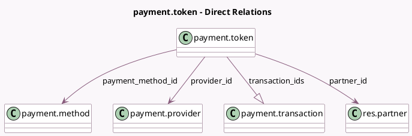

<!-- GENERATED:MODEL -->
---
tags: [odoo, community, generated, model]
---

# payment.token

- Module: [[docs/Community Addons/payment/payment|payment]]
- Scope: Community Addons
- Defined in module: yes
- Source files: `models/payment_token.py`
- Python classes: `PaymentToken`
- Description: Payment Token

## Field footprint

- Detected fields: 10
- Field types: `Boolean` x 1, `Char` x 3, `Many2one` x 4, `One2many` x 1, `Selection` x 1
- Relation fields: 5

## Sample fields

- `active`: `Boolean`
- `company_id`: `Many2one` (related `provider_id.company_id`, store `True`)
- `partner_id`: `Many2one` (comodel `res.partner`)
- `payment_details`: `Char`
- `payment_method_code`: `Char` (related `payment_method_id.code`)
- `payment_method_id`: `Many2one` (comodel `payment.method`)
- `provider_code`: `Selection` (related `provider_id.code`)
- `provider_id`: `Many2one` (comodel `payment.provider`)
- `provider_ref`: `Char`
- `transaction_ids`: `One2many` (comodel `payment.transaction`)

## Method hints

- Detected methods: 9
- Action methods: none
- Compute methods: `_compute_display_name`
- Onchange methods: none

## Direct relation diagram

## Navigation

- **Parent:** [[docs/Community Addons/payment/Models]]

<!-- GENERATED:MODEL -->
