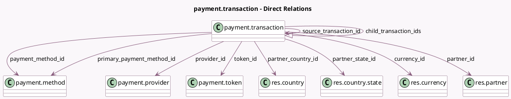

<!-- GENERATED:MODEL -->
---
tags: [odoo, community, generated, model]
---

# payment.transaction

- Module: [[docs/Community Addons/payment/payment|payment]]
- Scope: Community Addons
- Defined in module: yes
- Source files: `models/payment_transaction.py`
- Python classes: `PaymentTransaction`
- Description: Payment Transaction

## Field footprint

- Detected fields: 32
- Field types: `Boolean` x 3, `Char` x 10, `Datetime` x 1, `Integer` x 1, `Many2one` x 10, `Monetary` x 1, `One2many` x 1, `Selection` x 4, `Text` x 1
- Relation fields: 11

## Sample fields

- `amount`: `Monetary`
- `child_transaction_ids`: `One2many` (comodel `payment.transaction`)
- `company_id`: `Many2one` (related `provider_id.company_id`, store `True`)
- `currency_id`: `Many2one` (comodel `res.currency`)
- `is_live`: `Boolean`
- `is_post_processed`: `Boolean`
- `landing_route`: `Char`
- `last_state_change`: `Datetime`
- `operation`: `Selection`
- `partner_address`: `Char`
- `partner_city`: `Char`
- `partner_country_id`: `Many2one` (comodel `res.country`)
- `partner_email`: `Char`
- `partner_id`: `Many2one` (comodel `res.partner`)
- `partner_lang`: `Selection`
- `partner_name`: `Char`
- `partner_phone`: `Char`
- `partner_state_id`: `Many2one` (comodel `res.country.state`)
- `partner_zip`: `Char`
- `payment_method_code`: `Char` (related `payment_method_id.code`)

## Method hints

- Detected methods: 52
- Action methods: `action_capture`, `action_refund`, `action_view_refunds`, `action_void`
- Compute methods: `_compute_primary_payment_method_id`, `_compute_reference`, `_compute_reference_prefix`, `_compute_refunds_count`
- Onchange methods: none

## Direct relation diagram

## Navigation

- **Parent:** [[docs/Community Addons/payment/Models]]

<!-- GENERATED:MODEL -->
