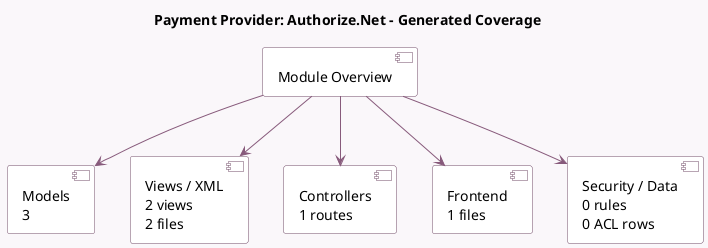

<!-- GENERATED:MODULE -->
---
tags: [odoo, community, module]
---

# Payment Provider: Authorize.Net

- Scope: Community Addons
- Source: odoo/addons/payment_authorize
- Dependencies: [[docs/Community Addons/payment/payment|payment]]

## Summary

An payment provider covering the US, Australia, and Canada.

## Generated coverage

- Models: 3
- XML files with UI/data artifacts: 2
- Views: 2
- Actions: 0
- Menus: 0
- Rules (ir.rule): 0
- Access CSV entries: 0
- Controller units: 1
- Frontend asset files: 1

## Module map

## Detail notes

- Models: [[docs/Community Addons/payment_authorize/Models|Models]] (3)
- Views and XML: [[docs/Community Addons/payment_authorize/Views|Views]] (2 files)
- Controllers: [[docs/Community Addons/payment_authorize/Controllers|Controllers]] (1)
- Frontend: [[docs/Community Addons/payment_authorize/Frontend|Frontend]] (1 files)

## Key models

- `payment.provider`
- `payment.token`
- `payment.transaction`

## Navigation

- [[../Community Addons/Community Addons|Back to scope]]
- [[../../docs/docs|Back to docs]]

<!-- GENERATED:MODULE -->

