<!-- GENERATED:MODEL -->
---
tags: [odoo, community, generated, model]
---

# payment.provider

- Module: [[docs/Community Addons/payment_paymob/payment_paymob|payment_paymob]]
- Scope: Community Addons
- Defined in module: extension only
- Source files: `models/payment_provider.py`
- Python classes: `PaymentProvider`

## Field footprint

- Detected fields: 6
- Field types: `Char` x 4, `Many2one` x 1, `Selection` x 1
- Relation fields: 1

## Sample fields

- `code`: `Selection`
- `paymob_account_country_id`: `Many2one` (comodel `res.country`)
- `paymob_api_key`: `Char`
- `paymob_hmac_key`: `Char`
- `paymob_public_key`: `Char`
- `paymob_secret_key`: `Char`

## Method hints

- Detected methods: 11
- Action methods: `action_sync_paymob_payment_methods`
- Compute methods: none
- Onchange methods: none

## Direct relation diagram

```plantuml
@startuml
!define ODOO_COLOR_PRIMARY #714B67
!define ODOO_COLOR_ACCENT #875A7B
!define ODOO_COLOR_BG #FAF7FA

skinparam backgroundColor ODOO_COLOR_BG
skinparam defaultTextAlignment left
skinparam ArrowColor ODOO_COLOR_ACCENT
skinparam ClassBackgroundColor white
skinparam ClassBorderColor ODOO_COLOR_PRIMARY
skinparam ComponentBackgroundColor white
skinparam ComponentBorderColor ODOO_COLOR_PRIMARY
skinparam NoteBackgroundColor #FFF8FF
skinparam NoteBorderColor ODOO_COLOR_ACCENT
skinparam SequenceLifeLineBorderColor ODOO_COLOR_ACCENT
skinparam SequenceLifeLineBackgroundColor #FFFFFF
skinparam SequenceParticipantBorderColor ODOO_COLOR_PRIMARY
skinparam SequenceParticipantBackgroundColor #FFFFFF
skinparam sequence {
  ArrowColor ODOO_COLOR_ACCENT
  ActorBorderColor ODOO_COLOR_PRIMARY
}
title payment.provider - Direct Relations
class "payment.provider" as payment_provider
class "res.country" as res_country
payment_provider --> res_country : paymob_account_country_id
@enduml
```

## Navigation

- **Parent:** [[docs/Community Addons/payment_paymob/Models]]

<!-- GENERATED:MODEL -->
