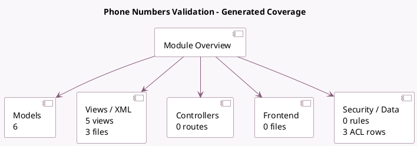

<!-- GENERATED:MODULE -->
---
tags: [odoo, community, module]
---

# Phone Numbers Validation

- Scope: Community Addons
- Source: odoo/addons/phone_validation
- Dependencies: base (not documented), [[docs/Community Addons/mail/mail|mail]]

## Summary

Validate and format phone numbers

## Generated coverage

- Models: 6
- XML files with UI/data artifacts: 3
- Views: 5
- Actions: 1
- Menus: 2
- Rules (ir.rule): 0
- Access CSV entries: 3
- Controller units: 0
- Frontend asset files: 0

## Module map

## Detail notes

- Models: [[docs/Community Addons/phone_validation/Models|Models]] (6)
- Views and XML: [[docs/Community Addons/phone_validation/Views|Views]] (3 files)

## Key models

- `base`
- `mail.thread.phone`
- `phone.blacklist`
- `phone.blacklist.remove`
- `res.partner`
- `res.users`

## Navigation

- [[../Community Addons/Community Addons|Back to scope]]
- [[../../docs/docs|Back to docs]]

<!-- GENERATED:MODULE -->

