<!-- GENERATED:MODEL -->
---
tags: [odoo, community, generated, model]
---

# account.move

- Module: [[docs/Community Addons/point_of_sale/point_of_sale|point_of_sale]]
- Scope: Community Addons
- Defined in module: yes
- Source files: `models/account_move.py`
- Python classes: `AccountMove`
- Inherits: `pos.load.mixin`

## Field footprint

- Detected fields: 6
- Field types: `Integer` x 1, `Many2many` x 1, `Many2one` x 1, `One2many` x 3
- Relation fields: 5

## Sample fields

- `pos_order_count`: `Integer` (compute `_compute_origin_pos_count`)
- `pos_order_ids`: `One2many` (comodel `pos.order`)
- `pos_payment_ids`: `One2many` (comodel `pos.payment`)
- `pos_refunded_invoice_ids`: `Many2many` (comodel `account.move`)
- `pos_session_ids`: `One2many` (comodel `pos.session`)
- `reversed_pos_order_id`: `Many2one` (comodel `pos.order`)

## Method hints

- Detected methods: 10
- Action methods: `action_view_source_pos_orders`
- Compute methods: `_compute_always_tax_exigible`, `_compute_amount`, `_compute_is_storno`, `_compute_origin_pos_count`, `_compute_payments_widget_reconciled_info`, `_compute_tax_totals`
- Onchange methods: none

## Direct relation diagram

```plantuml
@startuml
!define ODOO_COLOR_PRIMARY #714B67
!define ODOO_COLOR_ACCENT #875A7B
!define ODOO_COLOR_BG #FAF7FA

skinparam backgroundColor ODOO_COLOR_BG
skinparam defaultTextAlignment left
skinparam ArrowColor ODOO_COLOR_ACCENT
skinparam ClassBackgroundColor white
skinparam ClassBorderColor ODOO_COLOR_PRIMARY
skinparam ComponentBackgroundColor white
skinparam ComponentBorderColor ODOO_COLOR_PRIMARY
skinparam NoteBackgroundColor #FFF8FF
skinparam NoteBorderColor ODOO_COLOR_ACCENT
skinparam SequenceLifeLineBorderColor ODOO_COLOR_ACCENT
skinparam SequenceLifeLineBackgroundColor #FFFFFF
skinparam SequenceParticipantBorderColor ODOO_COLOR_PRIMARY
skinparam SequenceParticipantBackgroundColor #FFFFFF
skinparam sequence {
  ArrowColor ODOO_COLOR_ACCENT
  ActorBorderColor ODOO_COLOR_PRIMARY
}
title account.move - Direct Relations
class "account.move" as account_move
class "account.move" as account_move
class "pos.order" as pos_order
class "pos.payment" as pos_payment
class "pos.session" as pos_session
account_move --|> pos_order : pos_order_ids
account_move --|> pos_payment : pos_payment_ids
account_move .. account_move : pos_refunded_invoice_ids
account_move --> pos_order : reversed_pos_order_id
account_move --|> pos_session : pos_session_ids
@enduml
```

## Navigation

- **Parent:** [[docs/Community Addons/point_of_sale/Models]]

<!-- GENERATED:MODEL -->
