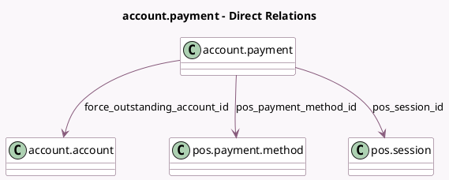

<!-- GENERATED:MODEL -->
---
tags: [odoo, community, generated, model]
---

# account.payment

- Module: [[docs/Community Addons/point_of_sale/point_of_sale|point_of_sale]]
- Scope: Community Addons
- Defined in module: extension only
- Source files: `models/account_payment.py`
- Python classes: `AccountPayment`

## Field footprint

- Detected fields: 3
- Field types: `Many2one` x 3
- Relation fields: 3

## Sample fields

- `force_outstanding_account_id`: `Many2one` (comodel `account.account`)
- `pos_payment_method_id`: `Many2one` (comodel `pos.payment.method`)
- `pos_session_id`: `Many2one` (comodel `pos.session`)

## Method hints

- Detected methods: 2
- Action methods: none
- Compute methods: `_compute_outstanding_account_id`
- Onchange methods: none

## Direct relation diagram

## Navigation

- **Parent:** [[docs/Community Addons/point_of_sale/Models]]

<!-- GENERATED:MODEL -->
