<!-- GENERATED:MODEL -->
---
tags: [odoo, community, generated, model]
---

# pos.bill

- Module: [[docs/Community Addons/point_of_sale/point_of_sale|point_of_sale]]
- Scope: Community Addons
- Defined in module: yes
- Source files: `models/pos_bill.py`
- Python classes: `PosBill`
- Description: Coins/Bills
- Inherits: `pos.load.mixin`

## Field footprint

- Detected fields: 3
- Field types: `Char` x 1, `Float` x 1, `Many2many` x 1
- Relation fields: 1

## Sample fields

- `name`: `Char` (comodel `Name`)
- `pos_config_ids`: `Many2many` (comodel `pos.config`)
- `value`: `Float` (comodel `Value`)

## Method hints

- Detected methods: 3
- Action methods: none
- Compute methods: none
- Onchange methods: none

## Direct relation diagram

```plantuml
@startuml
!define ODOO_COLOR_PRIMARY #714B67
!define ODOO_COLOR_ACCENT #875A7B
!define ODOO_COLOR_BG #FAF7FA

skinparam backgroundColor ODOO_COLOR_BG
skinparam defaultTextAlignment left
skinparam ArrowColor ODOO_COLOR_ACCENT
skinparam ClassBackgroundColor white
skinparam ClassBorderColor ODOO_COLOR_PRIMARY
skinparam ComponentBackgroundColor white
skinparam ComponentBorderColor ODOO_COLOR_PRIMARY
skinparam NoteBackgroundColor #FFF8FF
skinparam NoteBorderColor ODOO_COLOR_ACCENT
skinparam SequenceLifeLineBorderColor ODOO_COLOR_ACCENT
skinparam SequenceLifeLineBackgroundColor #FFFFFF
skinparam SequenceParticipantBorderColor ODOO_COLOR_PRIMARY
skinparam SequenceParticipantBackgroundColor #FFFFFF
skinparam sequence {
  ArrowColor ODOO_COLOR_ACCENT
  ActorBorderColor ODOO_COLOR_PRIMARY
}
title pos.bill - Direct Relations
class "pos.bill" as pos_bill
class "pos.config" as pos_config
pos_bill .. pos_config : pos_config_ids
@enduml
```

## Navigation

- **Parent:** [[docs/Community Addons/point_of_sale/Models]]

<!-- GENERATED:MODEL -->
