<!-- GENERATED:MODEL -->
---
tags: [odoo, community, generated, model]
---

# pos.category

- Module: [[docs/Community Addons/point_of_sale/point_of_sale|point_of_sale]]
- Scope: Community Addons
- Defined in module: yes
- Source files: `models/pos_category.py`
- Python classes: `PosCategory`
- Description: Point of Sale Category
- Inherits: `pos.load.mixin`

## Field footprint

- Detected fields: 10
- Field types: `Boolean` x 1, `Char` x 1, `Float` x 2, `Image` x 2, `Integer` x 2, `Many2one` x 1, `One2many` x 1
- Relation fields: 2

## Sample fields

- `child_ids`: `One2many` (comodel `pos.category`)
- `color`: `Integer` (comodel `Color`)
- `has_image`: `Boolean` (compute `_compute_has_image`)
- `hour_after`: `Float`
- `hour_until`: `Float`
- `image_128`: `Image` (comodel `Image 128`, related `image_512`, store `True`)
- `image_512`: `Image` (comodel `Image`)
- `name`: `Char`
- `parent_id`: `Many2one` (comodel `pos.category`)
- `sequence`: `Integer`

## Method hints

- Detected methods: 10
- Action methods: none
- Compute methods: `_compute_display_name`, `_compute_has_image`
- Onchange methods: none

## Direct relation diagram

```plantuml
@startuml
!define ODOO_COLOR_PRIMARY #714B67
!define ODOO_COLOR_ACCENT #875A7B
!define ODOO_COLOR_BG #FAF7FA

skinparam backgroundColor ODOO_COLOR_BG
skinparam defaultTextAlignment left
skinparam ArrowColor ODOO_COLOR_ACCENT
skinparam ClassBackgroundColor white
skinparam ClassBorderColor ODOO_COLOR_PRIMARY
skinparam ComponentBackgroundColor white
skinparam ComponentBorderColor ODOO_COLOR_PRIMARY
skinparam NoteBackgroundColor #FFF8FF
skinparam NoteBorderColor ODOO_COLOR_ACCENT
skinparam SequenceLifeLineBorderColor ODOO_COLOR_ACCENT
skinparam SequenceLifeLineBackgroundColor #FFFFFF
skinparam SequenceParticipantBorderColor ODOO_COLOR_PRIMARY
skinparam SequenceParticipantBackgroundColor #FFFFFF
skinparam sequence {
  ArrowColor ODOO_COLOR_ACCENT
  ActorBorderColor ODOO_COLOR_PRIMARY
}
title pos.category - Direct Relations
class "pos.category" as pos_category
class "pos.category" as pos_category
pos_category --> pos_category : parent_id
pos_category --|> pos_category : child_ids
@enduml
```

## Navigation

- **Parent:** [[docs/Community Addons/point_of_sale/Models]]

<!-- GENERATED:MODEL -->
