<!-- GENERATED:MODEL -->
---
tags: [odoo, community, generated, model]
---

# pos.config

- Module: [[docs/Community Addons/point_of_sale/point_of_sale|point_of_sale]]
- Scope: Community Addons
- Defined in module: yes
- Source files: `models/pos_config.py`
- Python classes: `PosConfig`
- Description: Point of Sale Configuration
- Inherits: `pos.bus.mixin`, `pos.load.mixin`

## Field footprint

- Detected fields: 95
- Field types: `Boolean` x 42, `Char` x 10, `Date` x 1, `Datetime` x 1, `Float` x 2, `Image` x 1, `Integer` x 1, `Json` x 1, `Many2many` x 10, `Many2one` x 21, `One2many` x 1, `Selection` x 2, `Text` x 2
- Relation fields: 32

## Sample fields

- `access_token`: `Char` (comodel `Access Token`)
- `active`: `Boolean`
- `amount_authorized_diff`: `Float` (comodel `Amount Authorized Difference`)
- `auto_validate_terminal_payment`: `Boolean`
- `available_preset_ids`: `Many2many` (comodel `pos.preset`)
- `available_pricelist_ids`: `Many2many` (comodel `product.pricelist`)
- `basic_receipt`: `Boolean`
- `cash_control`: `Boolean` (compute `_compute_cash_control`)
- `cash_rounding`: `Boolean`
- `company_has_template`: `Boolean` (compute `_compute_company_has_template`)
- `company_id`: `Many2one` (comodel `res.company`)
- `currency_id`: `Many2one` (comodel `res.currency`, compute `_compute_currency`, store `True`)
- `current_session_id`: `Many2one` (comodel `pos.session`, compute `_compute_current_session`)
- `current_session_state`: `Char` (compute `_compute_current_session`)
- `current_user_id`: `Many2one` (comodel `res.users`, compute `_compute_current_session_user`)
- `customer_display_bg_img`: `Image`
- `customer_display_bg_img_name`: `Char`
- `default_bill_ids`: `Many2many` (comodel `pos.bill`)
- `default_fiscal_position_id`: `Many2one` (comodel `account.fiscal.position`)
- `default_preset_id`: `Many2one` (comodel `pos.preset`)

## Method hints

- Detected methods: 90
- Action methods: `action_pos_config_modal_edit`
- Compute methods: `_compute_cash_control`, `_compute_company_has_template`, `_compute_currency`, `_compute_current_session`, `_compute_current_session_user`, `_compute_fast_payment_method_ids`, `_compute_is_installed_account_accountant`, `_compute_last_session`, and 2 more
- Onchange methods: none

## Direct relation diagram

```plantuml
@startuml
!define ODOO_COLOR_PRIMARY #714B67
!define ODOO_COLOR_ACCENT #875A7B
!define ODOO_COLOR_BG #FAF7FA

skinparam backgroundColor ODOO_COLOR_BG
skinparam defaultTextAlignment left
skinparam ArrowColor ODOO_COLOR_ACCENT
skinparam ClassBackgroundColor white
skinparam ClassBorderColor ODOO_COLOR_PRIMARY
skinparam ComponentBackgroundColor white
skinparam ComponentBorderColor ODOO_COLOR_PRIMARY
skinparam NoteBackgroundColor #FFF8FF
skinparam NoteBorderColor ODOO_COLOR_ACCENT
skinparam SequenceLifeLineBorderColor ODOO_COLOR_ACCENT
skinparam SequenceLifeLineBackgroundColor #FFFFFF
skinparam SequenceParticipantBorderColor ODOO_COLOR_PRIMARY
skinparam SequenceParticipantBackgroundColor #FFFFFF
skinparam sequence {
  ArrowColor ODOO_COLOR_ACCENT
  ActorBorderColor ODOO_COLOR_PRIMARY
}
title pos.config - Direct Relations
class "pos.config" as pos_config
class "account.cash.rounding" as account_cash_rounding
class "account.fiscal.position" as account_fiscal_position
class "account.journal" as account_journal
class "barcode.nomenclature" as barcode_nomenclature
class "ir.sequence" as ir_sequence
class "pos.bill" as pos_bill
class "pos.category" as pos_category
class "pos.config" as pos_config
class "pos.note" as pos_note
class "pos.payment.method" as pos_payment_method
class "pos.preset" as pos_preset
class "pos.printer" as pos_printer
pos_config .. pos_printer : printer_ids
pos_config --> stock_picking_type : picking_type_id
pos_config --> account_journal : journal_id
pos_config --> account_journal : invoice_journal_id
pos_config --> res_currency : currency_id
pos_config --> ir_sequence : order_seq_id
pos_config --> ir_sequence : order_backend_seq_id
pos_config --> ir_sequence : order_line_seq_id
pos_config --> ir_sequence : device_seq_id
pos_config .. pos_category : iface_available_categ_ids
pos_config --|> pos_session : session_ids
pos_config --> pos_session : current_session_id
pos_config --> product_pricelist : pricelist_id
pos_config .. product_pricelist : available_pricelist_ids
pos_config --> res_company : company_id
pos_config --> res_groups : group_pos_manager_id
pos_config --> res_groups : group_pos_user_id
pos_config --> product_product : tip_product_id
@enduml
```

## Navigation

- **Parent:** [[docs/Community Addons/point_of_sale/Models]]

<!-- GENERATED:MODEL -->
