<!-- GENERATED:MODEL -->
---
tags: [odoo, community, generated, model]
---

# pos.make.payment

- Module: [[docs/Community Addons/point_of_sale/point_of_sale|point_of_sale]]
- Scope: Community Addons
- Defined in module: yes
- Source files: `wizard/pos_payment.py`
- Python classes: `PosMakePayment`
- Description: Point of Sale Make Payment Wizard

## Field footprint

- Detected fields: 5
- Field types: `Char` x 1, `Datetime` x 1, `Float` x 1, `Many2one` x 2
- Relation fields: 2

## Sample fields

- `amount`: `Float`
- `config_id`: `Many2one` (comodel `pos.config`)
- `payment_date`: `Datetime`
- `payment_method_id`: `Many2one` (comodel `pos.payment.method`)
- `payment_name`: `Char`

## Method hints

- Detected methods: 5
- Action methods: none
- Compute methods: none
- Onchange methods: none

## Direct relation diagram

```plantuml
@startuml
!define ODOO_COLOR_PRIMARY #714B67
!define ODOO_COLOR_ACCENT #875A7B
!define ODOO_COLOR_BG #FAF7FA

skinparam backgroundColor ODOO_COLOR_BG
skinparam defaultTextAlignment left
skinparam ArrowColor ODOO_COLOR_ACCENT
skinparam ClassBackgroundColor white
skinparam ClassBorderColor ODOO_COLOR_PRIMARY
skinparam ComponentBackgroundColor white
skinparam ComponentBorderColor ODOO_COLOR_PRIMARY
skinparam NoteBackgroundColor #FFF8FF
skinparam NoteBorderColor ODOO_COLOR_ACCENT
skinparam SequenceLifeLineBorderColor ODOO_COLOR_ACCENT
skinparam SequenceLifeLineBackgroundColor #FFFFFF
skinparam SequenceParticipantBorderColor ODOO_COLOR_PRIMARY
skinparam SequenceParticipantBackgroundColor #FFFFFF
skinparam sequence {
  ArrowColor ODOO_COLOR_ACCENT
  ActorBorderColor ODOO_COLOR_PRIMARY
}
title pos.make.payment - Direct Relations
class "pos.make.payment" as pos_make_payment
class "pos.config" as pos_config
class "pos.payment.method" as pos_payment_method
pos_make_payment --> pos_config : config_id
pos_make_payment --> pos_payment_method : payment_method_id
@enduml
```

## Navigation

- **Parent:** [[docs/Community Addons/point_of_sale/Models]]

<!-- GENERATED:MODEL -->
