<!-- GENERATED:MODEL -->
---
tags: [odoo, community, generated, model]
---

# pos.order.line

- Module: [[docs/Community Addons/point_of_sale/point_of_sale|point_of_sale]]
- Scope: Community Addons
- Defined in module: yes
- Source files: `models/pos_order.py`
- Python classes: `PosOrderLine`
- Description: Point of Sale Order Lines
- Inherits: `pos.load.mixin`

## Field footprint

- Detected fields: 35
- Field types: `Boolean` x 2, `Char` x 6, `Float` x 7, `Json` x 1, `Many2many` x 3, `Many2one` x 8, `Monetary` x 3, `One2many` x 4, `Selection` x 1
- Relation fields: 15

## Sample fields

- `attribute_value_ids`: `Many2many` (comodel `product.template.attribute.value`)
- `combo_item_id`: `Many2one` (comodel `product.combo.item`)
- `combo_line_ids`: `One2many` (comodel `pos.order.line`)
- `combo_parent_id`: `Many2one` (comodel `pos.order.line`)
- `company_id`: `Many2one` (comodel `res.company`, related `order_id.company_id`, store `True`)
- `currency_id`: `Many2one` (comodel `res.currency`, related `order_id.currency_id`)
- `custom_attribute_value_ids`: `One2many` (comodel `product.attribute.custom.value`, store `True`)
- `customer_note`: `Char` (comodel `Customer Note`)
- `discount`: `Float`
- `extra_tax_data`: `Json`
- `full_product_name`: `Char` (comodel `Full Product Name`)
- `is_edited`: `Boolean` (comodel `Edited`)
- `is_total_cost_computed`: `Boolean`
- `margin`: `Monetary` (compute `_compute_margin`)
- `margin_percent`: `Float` (compute `_compute_margin`)
- `name`: `Char`
- `note`: `Char` (comodel `Product Note`)
- `notice`: `Char`
- `order_id`: `Many2one` (comodel `pos.order`)
- `pack_lot_ids`: `One2many` (comodel `pos.pack.operation.lot`)

## Method hints

- Detected methods: 25
- Action methods: none
- Compute methods: `_compute_amount_line_all`, `_compute_margin`, `_compute_refund_qty`, `_compute_total_cost`
- Onchange methods: `_onchange_amount_line_all`, `_onchange_product_id`, `_onchange_qty`

## Direct relation diagram

```plantuml
@startuml
!define ODOO_COLOR_PRIMARY #714B67
!define ODOO_COLOR_ACCENT #875A7B
!define ODOO_COLOR_BG #FAF7FA

skinparam backgroundColor ODOO_COLOR_BG
skinparam defaultTextAlignment left
skinparam ArrowColor ODOO_COLOR_ACCENT
skinparam ClassBackgroundColor white
skinparam ClassBorderColor ODOO_COLOR_PRIMARY
skinparam ComponentBackgroundColor white
skinparam ComponentBorderColor ODOO_COLOR_PRIMARY
skinparam NoteBackgroundColor #FFF8FF
skinparam NoteBorderColor ODOO_COLOR_ACCENT
skinparam SequenceLifeLineBorderColor ODOO_COLOR_ACCENT
skinparam SequenceLifeLineBackgroundColor #FFFFFF
skinparam SequenceParticipantBorderColor ODOO_COLOR_PRIMARY
skinparam SequenceParticipantBackgroundColor #FFFFFF
skinparam sequence {
  ArrowColor ODOO_COLOR_ACCENT
  ActorBorderColor ODOO_COLOR_PRIMARY
}
title pos.order.line - Direct Relations
class "pos.order.line" as pos_order_line
class "account.tax" as account_tax
class "pos.order" as pos_order
class "pos.order.line" as pos_order_line
class "pos.pack.operation.lot" as pos_pack_operation_lot
class "product.attribute.custom.value" as product_attribute_custom_value
class "product.combo.item" as product_combo_item
class "product.product" as product_product
class "product.template.attribute.value" as product_template_attribute_value
class "res.company" as res_company
class "res.currency" as res_currency
class "uom.uom" as uom_uom
pos_order_line --> res_company : company_id
pos_order_line --> product_product : product_id
pos_order_line .. product_template_attribute_value : attribute_value_ids
pos_order_line --|> product_attribute_custom_value : custom_attribute_value_ids
pos_order_line --> pos_order : order_id
pos_order_line .. account_tax : tax_ids
pos_order_line .. account_tax : tax_ids_after_fiscal_position
pos_order_line --|> pos_pack_operation_lot : pack_lot_ids
pos_order_line --> uom_uom : product_uom_id
pos_order_line --> res_currency : currency_id
pos_order_line --|> pos_order_line : refund_orderline_ids
pos_order_line --> pos_order_line : refunded_orderline_id
pos_order_line --> pos_order_line : combo_parent_id
pos_order_line --|> pos_order_line : combo_line_ids
pos_order_line --> product_combo_item : combo_item_id
@enduml
```

## Navigation

- **Parent:** [[docs/Community Addons/point_of_sale/Models]]

<!-- GENERATED:MODEL -->
