<!-- GENERATED:MODEL -->
---
tags: [odoo, community, generated, model]
---

# pos.order

- Module: [[docs/Community Addons/point_of_sale/point_of_sale|point_of_sale]]
- Scope: Community Addons
- Defined in module: yes
- Source files: `models/pos_order.py`
- Python classes: `PosOrder`
- Description: Point of Sale Orders
- Inherits: `mail.thread`, `portal.mixin`, `pos.bus.mixin`, `pos.load.mixin`

## Field footprint

- Detected fields: 61
- Field types: `Boolean` x 10, `Char` x 10, `Date` x 1, `Datetime` x 2, `Float` x 2, `Integer` x 4, `Many2many` x 2, `Many2one` x 14, `Monetary` x 7, `One2many` x 4, `Selection` x 3, `Text` x 2
- Relation fields: 20

## Sample fields

- `account_move`: `Many2one` (comodel `account.move`)
- `amount_difference`: `Monetary`
- `amount_paid`: `Monetary`
- `amount_return`: `Monetary`
- `amount_tax`: `Monetary`
- `amount_total`: `Monetary`
- `available_payment_method_ids`: `Many2many` (comodel `pos.payment.method`, related `config_id.payment_method_ids`, store `False`)
- `company_id`: `Many2one` (comodel `res.company`)
- `config_id`: `Many2one` (comodel `pos.config`, compute `_compute_order_config_id`, store `True`)
- `country_code`: `Char` (related `company_id.account_fiscal_country_id.code`)
- `currency_id`: `Many2one` (comodel `res.currency`, related `config_id.currency_id`)
- `currency_rate`: `Float` (comodel `Currency Rate`, compute `_compute_currency_rate`, store `True`)
- `date_order`: `Datetime`
- `email`: `Char` (compute `_compute_contact_details`, store `True`)
- `failed_pickings`: `Boolean` (compute `_compute_picking_count`)
- `fiscal_position_id`: `Many2one` (comodel `account.fiscal.position`)
- `floating_order_name`: `Char`
- `general_customer_note`: `Text`
- `has_deleted_line`: `Boolean`
- `has_refundable_lines`: `Boolean` (comodel `Has Refundable Lines`, compute `_compute_has_refundable_lines`)

## Method hints

- Detected methods: 76
- Action methods: `action_create_invoices`, `action_pos_order_cancel`, `action_pos_order_invoice`, `action_pos_order_paid`, `action_send_mail`, `action_send_receipt`, `action_stock_picking`, `action_view_invoice`, and 2 more
- Compute methods: `_compute_amount_paid`, `_compute_contact_details`, `_compute_currency_rate`, `_compute_has_refundable_lines`, `_compute_invoice_status`, `_compute_is_edited`, `_compute_is_invoiced`, `_compute_is_total_cost_computed`, and 8 more
- Onchange methods: `_onchange_amount_all`, `_onchange_partner_id`

## Direct relation diagram

```plantuml
@startuml
!define ODOO_COLOR_PRIMARY #714B67
!define ODOO_COLOR_ACCENT #875A7B
!define ODOO_COLOR_BG #FAF7FA

skinparam backgroundColor ODOO_COLOR_BG
skinparam defaultTextAlignment left
skinparam ArrowColor ODOO_COLOR_ACCENT
skinparam ClassBackgroundColor white
skinparam ClassBorderColor ODOO_COLOR_PRIMARY
skinparam ComponentBackgroundColor white
skinparam ComponentBorderColor ODOO_COLOR_PRIMARY
skinparam NoteBackgroundColor #FFF8FF
skinparam NoteBorderColor ODOO_COLOR_ACCENT
skinparam SequenceLifeLineBorderColor ODOO_COLOR_ACCENT
skinparam SequenceLifeLineBackgroundColor #FFFFFF
skinparam SequenceParticipantBorderColor ODOO_COLOR_PRIMARY
skinparam SequenceParticipantBackgroundColor #FFFFFF
skinparam sequence {
  ArrowColor ODOO_COLOR_ACCENT
  ActorBorderColor ODOO_COLOR_PRIMARY
}
title pos.order - Direct Relations
class "pos.order" as pos_order
class "account.fiscal.position" as account_fiscal_position
class "account.journal" as account_journal
class "account.move" as account_move
class "pos.config" as pos_config
class "pos.order" as pos_order
class "pos.order.line" as pos_order_line
class "pos.payment" as pos_payment
class "pos.payment.method" as pos_payment_method
class "pos.preset" as pos_preset
class "pos.session" as pos_session
class "product.pricelist" as product_pricelist
class "res.company" as res_company
pos_order --> res_users : user_id
pos_order --|> pos_order_line : lines
pos_order --> res_company : company_id
pos_order --> product_pricelist : pricelist_id
pos_order --> res_partner : partner_id
pos_order --> pos_session : session_id
pos_order --> pos_config : config_id
pos_order --> res_currency : currency_id
pos_order --> account_move : account_move
pos_order --|> stock_picking : picking_ids
pos_order --> stock_picking_type : picking_type_id
pos_order .. stock_reference : stock_reference_ids
pos_order --> pos_preset : preset_id
pos_order --> account_journal : sale_journal
pos_order --> account_fiscal_position : fiscal_position_id
pos_order --|> pos_payment : payment_ids
pos_order --> account_move : session_move_id
pos_order --> pos_order : refunded_order_id
@enduml
```

## Navigation

- **Parent:** [[docs/Community Addons/point_of_sale/Models]]

<!-- GENERATED:MODEL -->
