<!-- GENERATED:MODEL -->
---
tags: [odoo, community, generated, model]
---

# pos.pack.operation.lot

- Module: [[docs/Community Addons/point_of_sale/point_of_sale|point_of_sale]]
- Scope: Community Addons
- Defined in module: yes
- Source files: `models/pos_order.py`
- Python classes: `PosPackOperationLot`
- Description: Specify product lot/serial number in pos order line
- Inherits: `pos.load.mixin`

## Field footprint

- Detected fields: 4
- Field types: `Char` x 1, `Many2one` x 3
- Relation fields: 3

## Sample fields

- `lot_name`: `Char` (comodel `Lot Name`)
- `order_id`: `Many2one` (comodel `pos.order`, related `pos_order_line_id.order_id`)
- `pos_order_line_id`: `Many2one` (comodel `pos.order.line`)
- `product_id`: `Many2one` (comodel `product.product`, related `pos_order_line_id.product_id`)

## Method hints

- Detected methods: 2
- Action methods: none
- Compute methods: none
- Onchange methods: none

## Direct relation diagram

```plantuml
@startuml
!define ODOO_COLOR_PRIMARY #714B67
!define ODOO_COLOR_ACCENT #875A7B
!define ODOO_COLOR_BG #FAF7FA

skinparam backgroundColor ODOO_COLOR_BG
skinparam defaultTextAlignment left
skinparam ArrowColor ODOO_COLOR_ACCENT
skinparam ClassBackgroundColor white
skinparam ClassBorderColor ODOO_COLOR_PRIMARY
skinparam ComponentBackgroundColor white
skinparam ComponentBorderColor ODOO_COLOR_PRIMARY
skinparam NoteBackgroundColor #FFF8FF
skinparam NoteBorderColor ODOO_COLOR_ACCENT
skinparam SequenceLifeLineBorderColor ODOO_COLOR_ACCENT
skinparam SequenceLifeLineBackgroundColor #FFFFFF
skinparam SequenceParticipantBorderColor ODOO_COLOR_PRIMARY
skinparam SequenceParticipantBackgroundColor #FFFFFF
skinparam sequence {
  ArrowColor ODOO_COLOR_ACCENT
  ActorBorderColor ODOO_COLOR_PRIMARY
}
title pos.pack.operation.lot - Direct Relations
class "pos.pack.operation.lot" as pos_pack_operation_lot
class "pos.order" as pos_order
class "pos.order.line" as pos_order_line
class "product.product" as product_product
pos_pack_operation_lot --> pos_order_line : pos_order_line_id
pos_pack_operation_lot --> pos_order : order_id
pos_pack_operation_lot --> product_product : product_id
@enduml
```

## Navigation

- **Parent:** [[docs/Community Addons/point_of_sale/Models]]

<!-- GENERATED:MODEL -->
