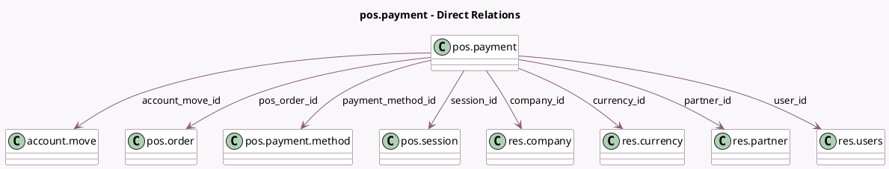

<!-- GENERATED:MODEL -->
---
tags: [odoo, community, generated, model]
---

# pos.payment

- Module: [[docs/Community Addons/point_of_sale/point_of_sale|point_of_sale]]
- Scope: Community Addons
- Defined in module: yes
- Source files: `models/pos_payment.py`
- Python classes: `PosPayment`
- Description: Point of Sale Payments
- Inherits: `pos.load.mixin`

## Field footprint

- Detected fields: 25
- Field types: `Boolean` x 1, `Char` x 13, `Datetime` x 1, `Float` x 1, `Many2one` x 8, `Monetary` x 1
- Relation fields: 8

## Sample fields

- `account_move_id`: `Many2one` (comodel `account.move`)
- `amount`: `Monetary`
- `card_brand`: `Char`
- `card_no`: `Char`
- `card_type`: `Char`
- `cardholder_name`: `Char`
- `company_id`: `Many2one` (comodel `res.company`, related `pos_order_id.company_id`, store `True`)
- `currency_id`: `Many2one` (comodel `res.currency`, related `pos_order_id.currency_id`)
- `currency_rate`: `Float` (related `pos_order_id.currency_rate`)
- `is_change`: `Boolean`
- `name`: `Char`
- `partner_id`: `Many2one` (comodel `res.partner`, related `pos_order_id.partner_id`)
- `payment_date`: `Datetime`
- `payment_method_authcode`: `Char`
- `payment_method_id`: `Many2one` (comodel `pos.payment.method`)
- `payment_method_issuer_bank`: `Char`
- `payment_method_payment_mode`: `Char`
- `payment_ref_no`: `Char`
- `payment_status`: `Char`
- `pos_order_id`: `Many2one` (comodel `pos.order`)

## Method hints

- Detected methods: 6
- Action methods: none
- Compute methods: `_compute_display_name`
- Onchange methods: none

## Direct relation diagram

## Navigation

- **Parent:** [[docs/Community Addons/point_of_sale/Models]]

<!-- GENERATED:MODEL -->
