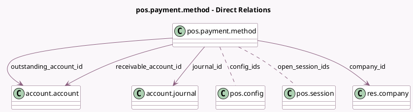

<!-- GENERATED:MODEL -->
---
tags: [odoo, community, generated, model]
---

# pos.payment.method

- Module: [[docs/Community Addons/point_of_sale/point_of_sale|point_of_sale]]
- Scope: Community Addons
- Defined in module: yes
- Source files: `models/pos_payment_method.py`
- Python classes: `PosPaymentMethod`
- Description: Point of Sale Payment Methods
- Inherits: `pos.load.mixin`

## Field footprint

- Detected fields: 20
- Field types: `Boolean` x 5, `Char` x 3, `Image` x 1, `Integer` x 1, `Many2many` x 2, `Many2one` x 4, `Selection` x 4
- Relation fields: 6

## Sample fields

- `active`: `Boolean`
- `company_id`: `Many2one` (comodel `res.company`)
- `config_ids`: `Many2many` (comodel `pos.config`)
- `default_pos_receivable_account_name`: `Char` (related `company_id.account_default_pos_receivable_account_id.display_name`)
- `default_qr`: `Char` (compute `_compute_qr`)
- `hide_qr_code_method`: `Boolean` (compute `_compute_hide_qr_code_method`)
- `hide_use_payment_terminal`: `Boolean` (compute `_compute_hide_use_payment_terminal`)
- `image`: `Image` (comodel `Image`)
- `is_cash_count`: `Boolean` (compute `_compute_is_cash_count`, store `True`)
- `journal_id`: `Many2one` (comodel `account.journal`)
- `name`: `Char`
- `open_session_ids`: `Many2many` (comodel `pos.session`, compute `_compute_open_session_ids`)
- `outstanding_account_id`: `Many2one` (comodel `account.account`)
- `payment_method_type`: `Selection`
- `qr_code_method`: `Selection`
- `receivable_account_id`: `Many2one` (comodel `account.account`)
- `sequence`: `Integer`
- `split_transactions`: `Boolean`
- `type`: `Selection` (compute `_compute_type`)
- `use_payment_terminal`: `Selection`

## Method hints

- Detected methods: 21
- Action methods: none
- Compute methods: `_compute_hide_qr_code_method`, `_compute_hide_use_payment_terminal`, `_compute_is_cash_count`, `_compute_open_session_ids`, `_compute_qr`, `_compute_type`
- Onchange methods: `_onchange_journal_id`, `_onchange_payment_method_type`, `_onchange_use_payment_terminal`

## Direct relation diagram

## Navigation

- **Parent:** [[docs/Community Addons/point_of_sale/Models]]

<!-- GENERATED:MODEL -->
