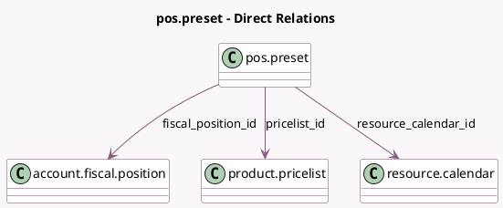

<!-- GENERATED:MODEL -->
---
tags: [odoo, community, generated, model]
---

# pos.preset

- Module: [[docs/Community Addons/point_of_sale/point_of_sale|point_of_sale]]
- Scope: Community Addons
- Defined in module: yes
- Source files: `models/pos_preset.py`
- Python classes: `PosPreset`
- Description: Easily load a set of configuration options
- Inherits: `pos.load.mixin`

## Field footprint

- Detected fields: 16
- Field types: `Boolean` x 3, `Char` x 1, `Image` x 2, `Integer` x 5, `Many2one` x 3, `One2many` x 1, `Selection` x 1
- Relation fields: 4

## Sample fields

- `attendance_ids`: `One2many` (related `resource_calendar_id.attendance_ids`)
- `color`: `Integer`
- `count_linked_config`: `Integer` (compute `_compute_count_linked_config`)
- `count_linked_orders`: `Integer` (compute `_compute_count_linked_orders`)
- `fiscal_position_id`: `Many2one` (comodel `account.fiscal.position`)
- `has_image`: `Boolean` (compute `_compute_has_image`)
- `identification`: `Selection`
- `image_128`: `Image` (related `image_512`, store `True`)
- `image_512`: `Image`
- `interval_time`: `Integer`
- `is_return`: `Boolean`
- `name`: `Char`
- `pricelist_id`: `Many2one` (comodel `product.pricelist`)
- `resource_calendar_id`: `Many2one` (comodel `resource.calendar`)
- `slots_per_interval`: `Integer`
- `use_timing`: `Boolean`

## Method hints

- Detected methods: 11
- Action methods: `action_open_linked_config`, `action_open_linked_orders`
- Compute methods: `_compute_count_linked_config`, `_compute_count_linked_orders`, `_compute_has_image`, `_compute_slots_usage`
- Onchange methods: none

## Direct relation diagram

## Navigation

- **Parent:** [[docs/Community Addons/point_of_sale/Models]]

<!-- GENERATED:MODEL -->
