<!-- GENERATED:MODEL -->
---
tags: [odoo, community, generated, model]
---

# pos.printer

- Module: [[docs/Community Addons/point_of_sale/point_of_sale|point_of_sale]]
- Scope: Community Addons
- Defined in module: yes
- Source files: `models/pos_printer.py`
- Python classes: `PosPrinter`
- Description: Point of Sale Printer
- Inherits: `pos.load.mixin`

## Field footprint

- Detected fields: 7
- Field types: `Char` x 3, `Many2many` x 2, `Many2one` x 1, `Selection` x 1
- Relation fields: 3

## Sample fields

- `company_id`: `Many2one` (comodel `res.company`)
- `epson_printer_ip`: `Char`
- `name`: `Char` (comodel `Printer Name`)
- `pos_config_ids`: `Many2many` (comodel `pos.config`)
- `printer_type`: `Selection`
- `product_categories_ids`: `Many2many` (comodel `pos.category`)
- `proxy_ip`: `Char` (comodel `Proxy IP Address`)

## Method hints

- Detected methods: 3
- Action methods: none
- Compute methods: none
- Onchange methods: none

## Direct relation diagram

```plantuml
@startuml
!define ODOO_COLOR_PRIMARY #714B67
!define ODOO_COLOR_ACCENT #875A7B
!define ODOO_COLOR_BG #FAF7FA

skinparam backgroundColor ODOO_COLOR_BG
skinparam defaultTextAlignment left
skinparam ArrowColor ODOO_COLOR_ACCENT
skinparam ClassBackgroundColor white
skinparam ClassBorderColor ODOO_COLOR_PRIMARY
skinparam ComponentBackgroundColor white
skinparam ComponentBorderColor ODOO_COLOR_PRIMARY
skinparam NoteBackgroundColor #FFF8FF
skinparam NoteBorderColor ODOO_COLOR_ACCENT
skinparam SequenceLifeLineBorderColor ODOO_COLOR_ACCENT
skinparam SequenceLifeLineBackgroundColor #FFFFFF
skinparam SequenceParticipantBorderColor ODOO_COLOR_PRIMARY
skinparam SequenceParticipantBackgroundColor #FFFFFF
skinparam sequence {
  ArrowColor ODOO_COLOR_ACCENT
  ActorBorderColor ODOO_COLOR_PRIMARY
}
title pos.printer - Direct Relations
class "pos.printer" as pos_printer
class "pos.category" as pos_category
class "pos.config" as pos_config
class "res.company" as res_company
pos_printer .. pos_category : product_categories_ids
pos_printer --> res_company : company_id
pos_printer .. pos_config : pos_config_ids
@enduml
```

## Navigation

- **Parent:** [[docs/Community Addons/point_of_sale/Models]]

<!-- GENERATED:MODEL -->
