<!-- GENERATED:MODEL -->
---
tags: [odoo, community, generated, model]
---

# pos.session

- Module: [[docs/Community Addons/point_of_sale/point_of_sale|point_of_sale]]
- Scope: Community Addons
- Defined in module: yes
- Source files: `models/pos_session.py`
- Python classes: `PosSession`
- Description: Point of Sale Session
- Inherits: `mail.activity.mixin`, `mail.thread`, `pos.bus.mixin`, `pos.load.mixin`

## Field footprint

- Detected fields: 30
- Field types: `Boolean` x 5, `Char` x 1, `Datetime` x 2, `Float` x 1, `Integer` x 2, `Many2many` x 1, `Many2one` x 6, `Monetary` x 5, `One2many` x 4, `Selection` x 1, `Text` x 2
- Relation fields: 11

## Sample fields

- `bank_payment_ids`: `One2many` (comodel `account.payment`)
- `cash_control`: `Boolean` (compute `_compute_cash_control`)
- `cash_journal_id`: `Many2one` (comodel `account.journal`, compute `_compute_cash_journal`, store `True`)
- `cash_real_transaction`: `Monetary`
- `cash_register_balance_end`: `Monetary` (compute `_compute_cash_balance`)
- `cash_register_balance_end_real`: `Monetary`
- `cash_register_balance_start`: `Monetary`
- `cash_register_difference`: `Monetary` (compute `_compute_cash_balance`)
- `closing_notes`: `Text`
- `company_id`: `Many2one` (comodel `res.company`, related `config_id.company_id`)
- `config_id`: `Many2one` (comodel `pos.config`)
- `currency_id`: `Many2one` (comodel `res.currency`, related `config_id.currency_id`)
- `failed_pickings`: `Boolean` (compute `_compute_picking_count`)
- `is_in_company_currency`: `Boolean` (comodel `Is Using Company Currency`, compute `_compute_is_in_company_currency`)
- `move_id`: `Many2one` (comodel `account.move`)
- `name`: `Char`
- `opening_notes`: `Text`
- `order_count`: `Integer` (compute `_compute_order_count`)
- `order_ids`: `One2many` (comodel `pos.order`)
- `payment_method_ids`: `Many2many` (comodel `pos.payment.method`, related `config_id.payment_method_ids`)

## Method hints

- Detected methods: 99
- Action methods: `action_pos_session_close`, `action_pos_session_closing_control`, `action_pos_session_open`, `action_pos_session_validate`, `action_show_payments_list`, `action_stock_picking`, `action_view_order`
- Compute methods: `_compute_cash_balance`, `_compute_cash_control`, `_compute_cash_journal`, `_compute_is_in_company_currency`, `_compute_order_count`, `_compute_picking_count`, `_compute_total_payments_amount`
- Onchange methods: none

## Direct relation diagram

```plantuml
@startuml
!define ODOO_COLOR_PRIMARY #714B67
!define ODOO_COLOR_ACCENT #875A7B
!define ODOO_COLOR_BG #FAF7FA

skinparam backgroundColor ODOO_COLOR_BG
skinparam defaultTextAlignment left
skinparam ArrowColor ODOO_COLOR_ACCENT
skinparam ClassBackgroundColor white
skinparam ClassBorderColor ODOO_COLOR_PRIMARY
skinparam ComponentBackgroundColor white
skinparam ComponentBorderColor ODOO_COLOR_PRIMARY
skinparam NoteBackgroundColor #FFF8FF
skinparam NoteBorderColor ODOO_COLOR_ACCENT
skinparam SequenceLifeLineBorderColor ODOO_COLOR_ACCENT
skinparam SequenceLifeLineBackgroundColor #FFFFFF
skinparam SequenceParticipantBorderColor ODOO_COLOR_PRIMARY
skinparam SequenceParticipantBackgroundColor #FFFFFF
skinparam sequence {
  ArrowColor ODOO_COLOR_ACCENT
  ActorBorderColor ODOO_COLOR_PRIMARY
}
title pos.session - Direct Relations
class "pos.session" as pos_session
class "account.bank.statement.line" as account_bank_statement_line
class "account.journal" as account_journal
class "account.move" as account_move
class "account.payment" as account_payment
class "pos.config" as pos_config
class "pos.order" as pos_order
class "pos.payment.method" as pos_payment_method
class "res.company" as res_company
class "res.currency" as res_currency
class "res.users" as res_users
class "stock.picking" as stock_picking
pos_session --> res_company : company_id
pos_session --> pos_config : config_id
pos_session --> res_users : user_id
pos_session --> res_currency : currency_id
pos_session --> account_journal : cash_journal_id
pos_session --|> pos_order : order_ids
pos_session --|> account_bank_statement_line : statement_line_ids
pos_session --|> stock_picking : picking_ids
pos_session --> account_move : move_id
pos_session .. pos_payment_method : payment_method_ids
pos_session --|> account_payment : bank_payment_ids
@enduml
```

## Navigation

- **Parent:** [[docs/Community Addons/point_of_sale/Models]]

<!-- GENERATED:MODEL -->
