<!-- GENERATED:MODEL -->
---
tags: [odoo, community, generated, model]
---

# product.template

- Module: [[docs/Community Addons/point_of_sale/point_of_sale|point_of_sale]]
- Scope: Community Addons
- Defined in module: yes
- Source files: `models/product_template.py`
- Python classes: `ProductTemplate`
- Inherits: `pos.load.mixin`

## Field footprint

- Detected fields: 7
- Field types: `Boolean` x 2, `Html` x 1, `Integer` x 2, `Many2many` x 2
- Relation fields: 2

## Sample fields

- `available_in_pos`: `Boolean`
- `color`: `Integer` (comodel `Color Index`, compute `_compute_color`, store `True`)
- `pos_categ_ids`: `Many2many` (comodel `pos.category`)
- `pos_optional_product_ids`: `Many2many` (comodel `product.template`)
- `pos_sequence`: `Integer`
- `public_description`: `Html`
- `to_weight`: `Boolean`

## Method hints

- Detected methods: 19
- Action methods: `action_archive`
- Compute methods: `_compute_color`
- Onchange methods: `_onchange_available_in_pos`, `_onchange_sale_ok`

## Direct relation diagram

```plantuml
@startuml
!define ODOO_COLOR_PRIMARY #714B67
!define ODOO_COLOR_ACCENT #875A7B
!define ODOO_COLOR_BG #FAF7FA

skinparam backgroundColor ODOO_COLOR_BG
skinparam defaultTextAlignment left
skinparam ArrowColor ODOO_COLOR_ACCENT
skinparam ClassBackgroundColor white
skinparam ClassBorderColor ODOO_COLOR_PRIMARY
skinparam ComponentBackgroundColor white
skinparam ComponentBorderColor ODOO_COLOR_PRIMARY
skinparam NoteBackgroundColor #FFF8FF
skinparam NoteBorderColor ODOO_COLOR_ACCENT
skinparam SequenceLifeLineBorderColor ODOO_COLOR_ACCENT
skinparam SequenceLifeLineBackgroundColor #FFFFFF
skinparam SequenceParticipantBorderColor ODOO_COLOR_PRIMARY
skinparam SequenceParticipantBackgroundColor #FFFFFF
skinparam sequence {
  ArrowColor ODOO_COLOR_ACCENT
  ActorBorderColor ODOO_COLOR_PRIMARY
}
title product.template - Direct Relations
class "product.template" as product_template
class "pos.category" as pos_category
class "product.template" as product_template
product_template .. pos_category : pos_categ_ids
product_template .. product_template : pos_optional_product_ids
@enduml
```

## Navigation

- **Parent:** [[docs/Community Addons/point_of_sale/Models]]

<!-- GENERATED:MODEL -->
