<!-- GENERATED:MODEL -->
---
tags: [odoo, community, generated, model]
---

# report.pos.order

- Module: [[docs/Community Addons/point_of_sale/point_of_sale|point_of_sale]]
- Scope: Community Addons
- Defined in module: yes
- Source files: `report/pos_order_report.py`
- Python classes: `ReportPosOrder`
- Description: Point of Sale Orders Report

## Field footprint

- Detected fields: 25
- Field types: `Boolean` x 1, `Datetime` x 1, `Float` x 6, `Integer` x 3, `Many2one` x 13, `Selection` x 1
- Relation fields: 13

## Sample fields

- `average_price`: `Float`
- `company_id`: `Many2one` (comodel `res.company`)
- `config_id`: `Many2one` (comodel `pos.config`)
- `date`: `Datetime`
- `delay_validation`: `Integer`
- `invoiced`: `Boolean`
- `journal_id`: `Many2one` (comodel `account.journal`)
- `margin`: `Float`
- `nbr_lines`: `Integer`
- `order_id`: `Many2one` (comodel `pos.order`)
- `partner_id`: `Many2one` (comodel `res.partner`)
- `payment_method_id`: `Many2one` (comodel `pos.payment.method`)
- `pos_categ_id`: `Many2one` (comodel `pos.category`)
- `price_sub_total`: `Float`
- `price_subtotal_excl`: `Float`
- `price_total`: `Float`
- `pricelist_id`: `Many2one` (comodel `product.pricelist`)
- `product_categ_id`: `Many2one` (comodel `product.category`)
- `product_id`: `Many2one` (comodel `product.product`)
- `product_qty`: `Integer`

## Method hints

- Detected methods: 4
- Action methods: none
- Compute methods: none
- Onchange methods: none

## Direct relation diagram

```plantuml
@startuml
!define ODOO_COLOR_PRIMARY #714B67
!define ODOO_COLOR_ACCENT #875A7B
!define ODOO_COLOR_BG #FAF7FA

skinparam backgroundColor ODOO_COLOR_BG
skinparam defaultTextAlignment left
skinparam ArrowColor ODOO_COLOR_ACCENT
skinparam ClassBackgroundColor white
skinparam ClassBorderColor ODOO_COLOR_PRIMARY
skinparam ComponentBackgroundColor white
skinparam ComponentBorderColor ODOO_COLOR_PRIMARY
skinparam NoteBackgroundColor #FFF8FF
skinparam NoteBorderColor ODOO_COLOR_ACCENT
skinparam SequenceLifeLineBorderColor ODOO_COLOR_ACCENT
skinparam SequenceLifeLineBackgroundColor #FFFFFF
skinparam SequenceParticipantBorderColor ODOO_COLOR_PRIMARY
skinparam SequenceParticipantBackgroundColor #FFFFFF
skinparam sequence {
  ArrowColor ODOO_COLOR_ACCENT
  ActorBorderColor ODOO_COLOR_PRIMARY
}
title report.pos.order - Direct Relations
class "report.pos.order" as report_pos_order
class "account.journal" as account_journal
class "pos.category" as pos_category
class "pos.config" as pos_config
class "pos.order" as pos_order
class "pos.payment.method" as pos_payment_method
class "pos.session" as pos_session
class "product.category" as product_category
class "product.pricelist" as product_pricelist
class "product.product" as product_product
class "product.template" as product_template
class "res.company" as res_company
class "res.partner" as res_partner
report_pos_order --> pos_order : order_id
report_pos_order --> res_partner : partner_id
report_pos_order --> product_product : product_id
report_pos_order --> product_template : product_tmpl_id
report_pos_order --> res_users : user_id
report_pos_order --> res_company : company_id
report_pos_order --> account_journal : journal_id
report_pos_order --> product_category : product_categ_id
report_pos_order --> pos_category : pos_categ_id
report_pos_order --> pos_config : config_id
report_pos_order --> product_pricelist : pricelist_id
report_pos_order --> pos_session : session_id
report_pos_order --> pos_payment_method : payment_method_id
@enduml
```

## Navigation

- **Parent:** [[docs/Community Addons/point_of_sale/Models]]

<!-- GENERATED:MODEL -->
