<!-- GENERATED:MODEL -->
---
tags: [odoo, community, generated, model]
---

# res.config.settings

- Module: [[docs/Community Addons/point_of_sale/point_of_sale|point_of_sale]]
- Scope: Community Addons
- Defined in module: extension only
- Source files: `models/res_config_settings.py`
- Python classes: `ResConfigSettings`

## Field footprint

- Detected fields: 90
- Field types: `Boolean` x 52, `Char` x 3, `Float` x 1, `Image` x 1, `Many2many` x 12, `Many2one` x 15, `Selection` x 4, `Text` x 2
- Relation fields: 27

## Sample fields

- `account_default_pos_receivable_account_id`: `Many2one` (related `company_id.account_default_pos_receivable_account_id`)
- `barcode_nomenclature_id`: `Many2one` (comodel `barcode.nomenclature`, related `company_id.nomenclature_id`)
- `group_pos_preset`: `Boolean`
- `is_kiosk_mode`: `Boolean`
- `module_pos_adyen`: `Boolean`
- `module_pos_mercado_pago`: `Boolean`
- `module_pos_pine_labs`: `Boolean`
- `module_pos_pricer`: `Boolean`
- `module_pos_qfpay`: `Boolean`
- `module_pos_razorpay`: `Boolean`
- `module_pos_stripe`: `Boolean`
- `module_pos_viva_com`: `Boolean`
- `point_of_sale_ticket_portal_url_display_mode`: `Selection` (related `company_id.point_of_sale_ticket_portal_url_display_mode`)
- `point_of_sale_ticket_unique_code`: `Boolean` (related `company_id.point_of_sale_ticket_unique_code`)
- `point_of_sale_use_ticket_qr_code`: `Boolean` (related `company_id.point_of_sale_use_ticket_qr_code`)
- `pos_allowed_pricelist_ids`: `Many2many` (comodel `product.pricelist`, compute `_compute_pos_allowed_pricelist_ids`)
- `pos_amount_authorized_diff`: `Float` (related `pos_config_id.amount_authorized_diff`)
- `pos_auto_validate_terminal_payment`: `Boolean` (related `pos_config_id.auto_validate_terminal_payment`)
- `pos_available_preset_ids`: `Many2many` (comodel `pos.preset`, related `pos_config_id.available_preset_ids`)
- `pos_available_pricelist_ids`: `Many2many` (comodel `product.pricelist`, compute `_compute_pos_pricelist_id`, store `True`)

## Method hints

- Detected methods: 21
- Action methods: `action_pos_config_create_new`, `action_pos_printer_dialog`
- Compute methods: `_compute_pos_allowed_pricelist_ids`, `_compute_pos_fiscal_positions`, `_compute_pos_iface_available_categ_ids`, `_compute_pos_iface_cashdrawer`, `_compute_pos_iface_electronic_scale`, `_compute_pos_iface_print_via_proxy`, `_compute_pos_iface_scan_via_proxy`, `_compute_pos_pricelist_id`, and 4 more
- Onchange methods: `_onchange_trusted_config_ids`

## Direct relation diagram

```plantuml
@startuml
!define ODOO_COLOR_PRIMARY #714B67
!define ODOO_COLOR_ACCENT #875A7B
!define ODOO_COLOR_BG #FAF7FA

skinparam backgroundColor ODOO_COLOR_BG
skinparam defaultTextAlignment left
skinparam ArrowColor ODOO_COLOR_ACCENT
skinparam ClassBackgroundColor white
skinparam ClassBorderColor ODOO_COLOR_PRIMARY
skinparam ComponentBackgroundColor white
skinparam ComponentBorderColor ODOO_COLOR_PRIMARY
skinparam NoteBackgroundColor #FFF8FF
skinparam NoteBorderColor ODOO_COLOR_ACCENT
skinparam SequenceLifeLineBorderColor ODOO_COLOR_ACCENT
skinparam SequenceLifeLineBackgroundColor #FFFFFF
skinparam SequenceParticipantBorderColor ODOO_COLOR_PRIMARY
skinparam SequenceParticipantBackgroundColor #FFFFFF
skinparam sequence {
  ArrowColor ODOO_COLOR_ACCENT
  ActorBorderColor ODOO_COLOR_PRIMARY
}
title res.config.settings - Direct Relations
class "res.config.settings" as res_config_settings
class "account.fiscal.position" as account_fiscal_position
class "account.tax" as account_tax
class "barcode.nomenclature" as barcode_nomenclature
class "pos.category" as pos_category
class "pos.config" as pos_config
class "pos.preset" as pos_preset
class "product.pricelist" as product_pricelist
class "product.product" as product_product
res_config_settings --> pos_config : pos_config_id
res_config_settings --> account_tax : sale_tax_id
res_config_settings --> barcode_nomenclature : barcode_nomenclature_id
res_config_settings --> pos_preset : pos_default_preset_id
res_config_settings .. pos_preset : pos_available_preset_ids
res_config_settings .. product_pricelist : pos_allowed_pricelist_ids
res_config_settings .. product_pricelist : pos_available_pricelist_ids
res_config_settings --> account_fiscal_position : pos_default_fiscal_position_id
res_config_settings .. account_fiscal_position : pos_fiscal_position_ids
res_config_settings .. pos_category : pos_iface_available_categ_ids
res_config_settings --> product_pricelist : pos_pricelist_id
@enduml
```

## Navigation

- **Parent:** [[docs/Community Addons/point_of_sale/Models]]

<!-- GENERATED:MODEL -->
