<!-- GENERATED:MODEL -->
---
tags: [odoo, community, generated, model]
---

# res.partner

- Module: [[docs/Community Addons/point_of_sale/point_of_sale|point_of_sale]]
- Scope: Community Addons
- Defined in module: yes
- Source files: `models/res_partner.py`
- Python classes: `ResPartner`
- Inherits: `pos.load.mixin`

## Field footprint

- Detected fields: 5
- Field types: `Char` x 2, `Integer` x 1, `Many2one` x 1, `One2many` x 1
- Relation fields: 2

## Sample fields

- `fiscal_position_id`: `Many2one` (comodel `account.fiscal.position`, compute `_compute_fiscal_position_id`)
- `invoice_emails`: `Char` (compute `_compute_invoice_emails`)
- `pos_contact_address`: `Char` (comodel `PoS Address`, compute `_compute_pos_contact_address`)
- `pos_order_count`: `Integer` (compute `_compute_pos_order`)
- `pos_order_ids`: `One2many` (comodel `pos.order`)

## Method hints

- Detected methods: 10
- Action methods: `action_view_pos_order`
- Compute methods: `_compute_application_statistics_hook`, `_compute_fiscal_position_id`, `_compute_invoice_emails`, `_compute_pos_contact_address`, `_compute_pos_order`
- Onchange methods: none

## Direct relation diagram

```plantuml
@startuml
!define ODOO_COLOR_PRIMARY #714B67
!define ODOO_COLOR_ACCENT #875A7B
!define ODOO_COLOR_BG #FAF7FA

skinparam backgroundColor ODOO_COLOR_BG
skinparam defaultTextAlignment left
skinparam ArrowColor ODOO_COLOR_ACCENT
skinparam ClassBackgroundColor white
skinparam ClassBorderColor ODOO_COLOR_PRIMARY
skinparam ComponentBackgroundColor white
skinparam ComponentBorderColor ODOO_COLOR_PRIMARY
skinparam NoteBackgroundColor #FFF8FF
skinparam NoteBorderColor ODOO_COLOR_ACCENT
skinparam SequenceLifeLineBorderColor ODOO_COLOR_ACCENT
skinparam SequenceLifeLineBackgroundColor #FFFFFF
skinparam SequenceParticipantBorderColor ODOO_COLOR_PRIMARY
skinparam SequenceParticipantBackgroundColor #FFFFFF
skinparam sequence {
  ArrowColor ODOO_COLOR_ACCENT
  ActorBorderColor ODOO_COLOR_PRIMARY
}
title res.partner - Direct Relations
class "res.partner" as res_partner
class "account.fiscal.position" as account_fiscal_position
class "pos.order" as pos_order
res_partner --|> pos_order : pos_order_ids
res_partner --> account_fiscal_position : fiscal_position_id
@enduml
```

## Navigation

- **Parent:** [[docs/Community Addons/point_of_sale/Models]]

<!-- GENERATED:MODEL -->
