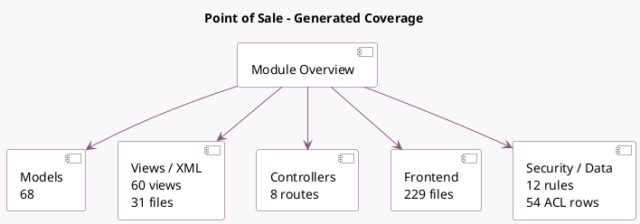

<!-- GENERATED:MODULE -->
---
tags: [odoo, community, module]
---

# Point of Sale

- Scope: Community Addons
- Source: odoo/addons/point_of_sale
- Dependencies: [[docs/Community Addons/resource/resource|resource]], [[docs/Community Addons/stock_account/stock_account|stock_account]], [[docs/Community Addons/barcodes/barcodes|barcodes]], [[docs/Community Addons/html_editor/html_editor|html_editor]], [[docs/Community Addons/digest/digest|digest]], [[docs/Community Addons/phone_validation/phone_validation|phone_validation]], [[docs/Community Addons/partner_autocomplete/partner_autocomplete|partner_autocomplete]], [[docs/Community Addons/iot_base/iot_base|iot_base]], [[docs/Community Addons/google_address_autocomplete/google_address_autocomplete|google_address_autocomplete]]

## Summary

Handle checkouts and payments for shops and restaurants.

## Generated coverage

- Models: 68
- XML files with UI/data artifacts: 31
- Views: 60
- Actions: 38
- Menus: 29
- Rules (ir.rule): 12
- Access CSV entries: 54
- Controller units: 2
- Frontend asset files: 229

## Module map

## Detail notes

- Models: [[docs/Community Addons/point_of_sale/Models|Models]] (68)
- Views and XML: [[docs/Community Addons/point_of_sale/Views|Views]] (31 files)
- Controllers: [[docs/Community Addons/point_of_sale/Controllers|Controllers]] (2)
- Frontend: [[docs/Community Addons/point_of_sale/Frontend|Frontend]] (229 files)

## Key models

- `account.bank.statement.line`
- `account.cash.rounding`
- `account.fiscal.position`
- `account.journal`
- `account.move`
- `account.move.line`
- `account.payment`
- `account.tax`
- `account.tax.group`
- `barcode.rule`
- `decimal.precision`
- `digest.digest`

## Navigation

- [[../Community Addons/Community Addons|Back to scope]]
- [[../../docs/docs|Back to docs]]

<!-- GENERATED:MODULE -->

