<!-- GENERATED:MODEL -->
---
tags: [odoo, community, generated, model]
---

# portal.share

- Module: [[docs/Community Addons/portal/portal|portal]]
- Scope: Community Addons
- Defined in module: yes
- Source files: `wizard/portal_share.py`
- Python classes: `PortalShare`
- Description: Portal Sharing

## Field footprint

- Detected fields: 7
- Field types: `Char` x 2, `Integer` x 1, `Many2many` x 1, `Reference` x 1, `Text` x 2
- Relation fields: 1

## Sample fields

- `access_warning`: `Text` (comodel `Access warning`, compute `_compute_access_warning`)
- `note`: `Text`
- `partner_ids`: `Many2many` (comodel `res.partner`)
- `res_id`: `Integer` (comodel `Related Document ID`)
- `res_model`: `Char` (comodel `Related Document Model`)
- `resource_ref`: `Reference` (comodel `_selection_target_model`, compute `_compute_resource_ref`)
- `share_link`: `Char` (compute `_compute_share_link`)

## Method hints

- Detected methods: 8
- Action methods: `action_send_mail`
- Compute methods: `_compute_access_warning`, `_compute_resource_ref`, `_compute_share_link`
- Onchange methods: none

## Direct relation diagram

```plantuml
@startuml
!define ODOO_COLOR_PRIMARY #714B67
!define ODOO_COLOR_ACCENT #875A7B
!define ODOO_COLOR_BG #FAF7FA

skinparam backgroundColor ODOO_COLOR_BG
skinparam defaultTextAlignment left
skinparam ArrowColor ODOO_COLOR_ACCENT
skinparam ClassBackgroundColor white
skinparam ClassBorderColor ODOO_COLOR_PRIMARY
skinparam ComponentBackgroundColor white
skinparam ComponentBorderColor ODOO_COLOR_PRIMARY
skinparam NoteBackgroundColor #FFF8FF
skinparam NoteBorderColor ODOO_COLOR_ACCENT
skinparam SequenceLifeLineBorderColor ODOO_COLOR_ACCENT
skinparam SequenceLifeLineBackgroundColor #FFFFFF
skinparam SequenceParticipantBorderColor ODOO_COLOR_PRIMARY
skinparam SequenceParticipantBackgroundColor #FFFFFF
skinparam sequence {
  ArrowColor ODOO_COLOR_ACCENT
  ActorBorderColor ODOO_COLOR_PRIMARY
}
title portal.share - Direct Relations
class "portal.share" as portal_share
class "res.partner" as res_partner
portal_share .. res_partner : partner_ids
@enduml
```

## Navigation

- **Parent:** [[docs/Community Addons/portal/Models]]

<!-- GENERATED:MODEL -->
