<!-- GENERATED:MODEL -->
---
tags: [odoo, community, generated, model]
---

# portal.wizard

- Module: [[docs/Community Addons/portal/portal|portal]]
- Scope: Community Addons
- Defined in module: yes
- Source files: `wizard/portal_wizard.py`
- Python classes: `PortalWizard`
- Description: Grant Portal Access

## Field footprint

- Detected fields: 3
- Field types: `Many2many` x 1, `One2many` x 1, `Text` x 1
- Relation fields: 2

## Sample fields

- `partner_ids`: `Many2many` (comodel `res.partner`)
- `user_ids`: `One2many` (comodel `portal.wizard.user`, compute `_compute_user_ids`, store `True`)
- `welcome_message`: `Text` (comodel `Invitation Message`)

## Method hints

- Detected methods: 4
- Action methods: `action_open_wizard`
- Compute methods: `_compute_user_ids`
- Onchange methods: none

## Direct relation diagram

```plantuml
@startuml
!define ODOO_COLOR_PRIMARY #714B67
!define ODOO_COLOR_ACCENT #875A7B
!define ODOO_COLOR_BG #FAF7FA

skinparam backgroundColor ODOO_COLOR_BG
skinparam defaultTextAlignment left
skinparam ArrowColor ODOO_COLOR_ACCENT
skinparam ClassBackgroundColor white
skinparam ClassBorderColor ODOO_COLOR_PRIMARY
skinparam ComponentBackgroundColor white
skinparam ComponentBorderColor ODOO_COLOR_PRIMARY
skinparam NoteBackgroundColor #FFF8FF
skinparam NoteBorderColor ODOO_COLOR_ACCENT
skinparam SequenceLifeLineBorderColor ODOO_COLOR_ACCENT
skinparam SequenceLifeLineBackgroundColor #FFFFFF
skinparam SequenceParticipantBorderColor ODOO_COLOR_PRIMARY
skinparam SequenceParticipantBackgroundColor #FFFFFF
skinparam sequence {
  ArrowColor ODOO_COLOR_ACCENT
  ActorBorderColor ODOO_COLOR_PRIMARY
}
title portal.wizard - Direct Relations
class "portal.wizard" as portal_wizard
class "portal.wizard.user" as portal_wizard_user
class "res.partner" as res_partner
portal_wizard .. res_partner : partner_ids
portal_wizard --|> portal_wizard_user : user_ids
@enduml
```

## Navigation

- **Parent:** [[docs/Community Addons/portal/Models]]

<!-- GENERATED:MODEL -->
