<!-- GENERATED:MODEL -->
---
tags: [odoo, community, generated, model]
---

# portal.wizard.user

- Module: [[docs/Community Addons/portal/portal|portal]]
- Scope: Community Addons
- Defined in module: yes
- Source files: `wizard/portal_wizard.py`
- Python classes: `PortalWizardUser`
- Description: Portal User Config

## Field footprint

- Detected fields: 8
- Field types: `Boolean` x 2, `Char` x 1, `Datetime` x 1, `Many2one` x 3, `Selection` x 1
- Relation fields: 3

## Sample fields

- `email`: `Char` (comodel `Email`)
- `email_state`: `Selection` (compute `_compute_email_state`)
- `is_internal`: `Boolean` (comodel `Is Internal`, compute `_compute_group_details`)
- `is_portal`: `Boolean` (comodel `Is Portal`, compute `_compute_group_details`)
- `login_date`: `Datetime` (related `user_id.login_date`)
- `partner_id`: `Many2one` (comodel `res.partner`)
- `user_id`: `Many2one` (comodel `res.users`, compute `_compute_user_id`)
- `wizard_id`: `Many2one` (comodel `portal.wizard`)

## Method hints

- Detected methods: 14
- Action methods: `action_grant_access`, `action_invite_again`, `action_refresh_modal`, `action_revoke_access`
- Compute methods: `_compute_email_state`, `_compute_group_details`, `_compute_user_id`
- Onchange methods: none

## Direct relation diagram

```plantuml
@startuml
!define ODOO_COLOR_PRIMARY #714B67
!define ODOO_COLOR_ACCENT #875A7B
!define ODOO_COLOR_BG #FAF7FA

skinparam backgroundColor ODOO_COLOR_BG
skinparam defaultTextAlignment left
skinparam ArrowColor ODOO_COLOR_ACCENT
skinparam ClassBackgroundColor white
skinparam ClassBorderColor ODOO_COLOR_PRIMARY
skinparam ComponentBackgroundColor white
skinparam ComponentBorderColor ODOO_COLOR_PRIMARY
skinparam NoteBackgroundColor #FFF8FF
skinparam NoteBorderColor ODOO_COLOR_ACCENT
skinparam SequenceLifeLineBorderColor ODOO_COLOR_ACCENT
skinparam SequenceLifeLineBackgroundColor #FFFFFF
skinparam SequenceParticipantBorderColor ODOO_COLOR_PRIMARY
skinparam SequenceParticipantBackgroundColor #FFFFFF
skinparam sequence {
  ArrowColor ODOO_COLOR_ACCENT
  ActorBorderColor ODOO_COLOR_PRIMARY
}
title portal.wizard.user - Direct Relations
class "portal.wizard.user" as portal_wizard_user
class "portal.wizard" as portal_wizard
class "res.partner" as res_partner
class "res.users" as res_users
portal_wizard_user --> portal_wizard : wizard_id
portal_wizard_user --> res_partner : partner_id
portal_wizard_user --> res_users : user_id
@enduml
```

## Navigation

- **Parent:** [[docs/Community Addons/portal/Models]]

<!-- GENERATED:MODEL -->
