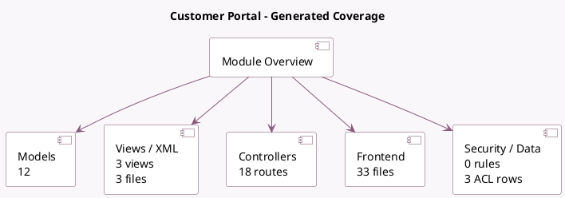

<!-- GENERATED:MODULE -->
---
tags: [odoo, community, module]
---

# Customer Portal

- Scope: Community Addons
- Source: odoo/addons/portal
- Dependencies: [[docs/Community Addons/web/web|web]], [[docs/Community Addons/html_editor/html_editor|html_editor]], [[docs/Community Addons/http_routing/http_routing|http_routing]], [[docs/Community Addons/mail/mail|mail]], [[docs/Community Addons/auth_signup/auth_signup|auth_signup]]

## Summary

Customer Portal

## Generated coverage

- Models: 12
- XML files with UI/data artifacts: 3
- Views: 3
- Actions: 3
- Menus: 0
- Rules (ir.rule): 0
- Access CSV entries: 3
- Controller units: 4
- Frontend asset files: 33

## Module map

## Detail notes

- Models: [[docs/Community Addons/portal/Models|Models]] (12)
- Views and XML: [[docs/Community Addons/portal/Views|Views]] (3 files)
- Controllers: [[docs/Community Addons/portal/Controllers|Controllers]] (4)
- Frontend: [[docs/Community Addons/portal/Frontend|Frontend]] (33 files)

## Key models

- `ir.http`
- `ir.qweb`
- `ir.ui.view`
- `mail.message`
- `mail.thread`
- `portal.mixin`
- `portal.share`
- `portal.wizard`
- `portal.wizard.user`
- `res.config.settings`
- `res.partner`
- `res.users.apikeys.description`

## Navigation

- [[../Community Addons/Community Addons|Back to scope]]
- [[../../docs/docs|Back to docs]]

<!-- GENERATED:MODULE -->

