<!-- GENERATED:MODEL -->
---
tags: [odoo, community, generated, model]
---

# rating.rating

- Module: [[docs/Community Addons/portal_rating/portal_rating|portal_rating]]
- Scope: Community Addons
- Defined in module: extension only
- Source files: `models/rating_rating.py`
- Python classes: `RatingRating`

## Field footprint

- Detected fields: 3
- Field types: `Datetime` x 1, `Many2one` x 1, `Text` x 1
- Relation fields: 1

## Sample fields

- `publisher_comment`: `Text` (comodel `Publisher comment`)
- `publisher_datetime`: `Datetime` (comodel `Commented on`)
- `publisher_id`: `Many2one` (comodel `res.partner`)

## Method hints

- Detected methods: 4
- Action methods: none
- Compute methods: none
- Onchange methods: none

## Direct relation diagram

```plantuml
@startuml
!define ODOO_COLOR_PRIMARY #714B67
!define ODOO_COLOR_ACCENT #875A7B
!define ODOO_COLOR_BG #FAF7FA

skinparam backgroundColor ODOO_COLOR_BG
skinparam defaultTextAlignment left
skinparam ArrowColor ODOO_COLOR_ACCENT
skinparam ClassBackgroundColor white
skinparam ClassBorderColor ODOO_COLOR_PRIMARY
skinparam ComponentBackgroundColor white
skinparam ComponentBorderColor ODOO_COLOR_PRIMARY
skinparam NoteBackgroundColor #FFF8FF
skinparam NoteBorderColor ODOO_COLOR_ACCENT
skinparam SequenceLifeLineBorderColor ODOO_COLOR_ACCENT
skinparam SequenceLifeLineBackgroundColor #FFFFFF
skinparam SequenceParticipantBorderColor ODOO_COLOR_PRIMARY
skinparam SequenceParticipantBackgroundColor #FFFFFF
skinparam sequence {
  ArrowColor ODOO_COLOR_ACCENT
  ActorBorderColor ODOO_COLOR_PRIMARY
}
title rating.rating - Direct Relations
class "rating.rating" as rating_rating
class "res.partner" as res_partner
rating_rating --> res_partner : publisher_id
@enduml
```

## Navigation

- **Parent:** [[docs/Community Addons/portal_rating/Models]]

<!-- GENERATED:MODEL -->
