<!-- GENERATED:MODEL -->
---
tags: [odoo, community, generated, model]
---

# pos.config

- Module: [[docs/Community Addons/pos_discount/pos_discount|pos_discount]]
- Scope: Community Addons
- Defined in module: extension only
- Source files: `models/pos_config.py`
- Python classes: `PosConfig`

## Field footprint

- Detected fields: 3
- Field types: `Boolean` x 1, `Float` x 1, `Many2one` x 1
- Relation fields: 1

## Sample fields

- `discount_pc`: `Float`
- `discount_product_id`: `Many2one` (comodel `product.product`)
- `iface_discount`: `Boolean`

## Method hints

- Detected methods: 3
- Action methods: none
- Compute methods: none
- Onchange methods: none

## Direct relation diagram

```plantuml
@startuml
!define ODOO_COLOR_PRIMARY #714B67
!define ODOO_COLOR_ACCENT #875A7B
!define ODOO_COLOR_BG #FAF7FA

skinparam backgroundColor ODOO_COLOR_BG
skinparam defaultTextAlignment left
skinparam ArrowColor ODOO_COLOR_ACCENT
skinparam ClassBackgroundColor white
skinparam ClassBorderColor ODOO_COLOR_PRIMARY
skinparam ComponentBackgroundColor white
skinparam ComponentBorderColor ODOO_COLOR_PRIMARY
skinparam NoteBackgroundColor #FFF8FF
skinparam NoteBorderColor ODOO_COLOR_ACCENT
skinparam SequenceLifeLineBorderColor ODOO_COLOR_ACCENT
skinparam SequenceLifeLineBackgroundColor #FFFFFF
skinparam SequenceParticipantBorderColor ODOO_COLOR_PRIMARY
skinparam SequenceParticipantBackgroundColor #FFFFFF
skinparam sequence {
  ArrowColor ODOO_COLOR_ACCENT
  ActorBorderColor ODOO_COLOR_PRIMARY
}
title pos.config - Direct Relations
class "pos.config" as pos_config
class "product.product" as product_product
pos_config --> product_product : discount_product_id
@enduml
```

## Navigation

- **Parent:** [[docs/Community Addons/pos_discount/Models]]

<!-- GENERATED:MODEL -->
