<!-- GENERATED:MODEL -->
---
tags: [odoo, community, generated, model]
---

# event.registration

- Module: [[docs/Community Addons/pos_event/pos_event|pos_event]]
- Scope: Community Addons
- Defined in module: yes
- Source files: `models/event_registration.py`
- Python classes: `EventRegistration`
- Inherits: `pos.load.mixin`

## Field footprint

- Detected fields: 2
- Field types: `Many2one` x 2
- Relation fields: 2

## Sample fields

- `pos_order_id`: `Many2one` (related `pos_order_line_id.order_id`)
- `pos_order_line_id`: `Many2one` (comodel `pos.order.line`)

## Method hints

- Detected methods: 8
- Action methods: `action_view_pos_order`
- Compute methods: `_compute_registration_status`
- Onchange methods: none

## Direct relation diagram

```plantuml
@startuml
!define ODOO_COLOR_PRIMARY #714B67
!define ODOO_COLOR_ACCENT #875A7B
!define ODOO_COLOR_BG #FAF7FA

skinparam backgroundColor ODOO_COLOR_BG
skinparam defaultTextAlignment left
skinparam ArrowColor ODOO_COLOR_ACCENT
skinparam ClassBackgroundColor white
skinparam ClassBorderColor ODOO_COLOR_PRIMARY
skinparam ComponentBackgroundColor white
skinparam ComponentBorderColor ODOO_COLOR_PRIMARY
skinparam NoteBackgroundColor #FFF8FF
skinparam NoteBorderColor ODOO_COLOR_ACCENT
skinparam SequenceLifeLineBorderColor ODOO_COLOR_ACCENT
skinparam SequenceLifeLineBackgroundColor #FFFFFF
skinparam SequenceParticipantBorderColor ODOO_COLOR_PRIMARY
skinparam SequenceParticipantBackgroundColor #FFFFFF
skinparam sequence {
  ArrowColor ODOO_COLOR_ACCENT
  ActorBorderColor ODOO_COLOR_PRIMARY
}
title event.registration - Direct Relations
class "event.registration" as event_registration
class "pos.order.line" as pos_order_line
event_registration --> pos_order_line : pos_order_line_id
@enduml
```

## Navigation

- **Parent:** [[docs/Community Addons/pos_event/Models]]

<!-- GENERATED:MODEL -->
