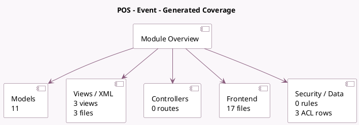

<!-- GENERATED:MODULE -->
---
tags: [odoo, community, module]
---

# POS - Event

- Scope: Community Addons
- Source: odoo/addons/pos_event
- Dependencies: [[docs/Community Addons/point_of_sale/point_of_sale|point_of_sale]], [[docs/Community Addons/event_product/event_product|event_product]]

## Summary

Link module between Point of Sale and Event

## Generated coverage

- Models: 11
- XML files with UI/data artifacts: 3
- Views: 3
- Actions: 0
- Menus: 0
- Rules (ir.rule): 0
- Access CSV entries: 3
- Controller units: 0
- Frontend asset files: 17

## Module map

## Detail notes

- Models: [[docs/Community Addons/pos_event/Models|Models]] (11)
- Views and XML: [[docs/Community Addons/pos_event/Views|Views]] (3 files)
- Frontend: [[docs/Community Addons/pos_event/Frontend|Frontend]] (17 files)

## Key models

- `event.event`
- `event.event.ticket`
- `event.question`
- `event.question.answer`
- `event.registration`
- `event.registration.answer`
- `event.slot`
- `pos.config`
- `pos.order`
- `pos.order.line`
- `pos.session`

## Navigation

- [[../Community Addons/Community Addons|Back to scope]]
- [[../../docs/docs|Back to docs]]

<!-- GENERATED:MODULE -->

