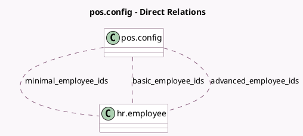

<!-- GENERATED:MODEL -->
---
tags: [odoo, community, generated, model]
---

# pos.config

- Module: [[docs/Community Addons/pos_hr/pos_hr|pos_hr]]
- Scope: Community Addons
- Defined in module: extension only
- Source files: `models/pos_config.py`
- Python classes: `PosConfig`

## Field footprint

- Detected fields: 3
- Field types: `Many2many` x 3
- Relation fields: 3

## Sample fields

- `advanced_employee_ids`: `Many2many` (comodel `hr.employee`)
- `basic_employee_ids`: `Many2many` (comodel `hr.employee`)
- `minimal_employee_ids`: `Many2many` (comodel `hr.employee`)

## Method hints

- Detected methods: 5
- Action methods: none
- Compute methods: none
- Onchange methods: `_onchange_advanced_employee_ids`, `_onchange_basic_employee_ids`, `_onchange_minimal_employee_ids`

## Direct relation diagram

## Navigation

- **Parent:** [[docs/Community Addons/pos_hr/Models]]

<!-- GENERATED:MODEL -->
