<!-- GENERATED:MODEL -->
---
tags: [odoo, community, generated, model]
---

# pos.daily.sales.reports.wizard

- Module: [[docs/Community Addons/pos_hr/pos_hr|pos_hr]]
- Scope: Community Addons
- Defined in module: extension only
- Source files: `wizard/pos_daily_sales_reports.py`
- Python classes: `PosDailySalesReportsWizard`

## Field footprint

- Detected fields: 2
- Field types: `Boolean` x 1, `Many2many` x 1
- Relation fields: 1

## Sample fields

- `add_report_per_employee`: `Boolean`
- `employee_ids`: `Many2many` (comodel `hr.employee`, compute `_compute_employee_ids`)

## Method hints

- Detected methods: 3
- Action methods: none
- Compute methods: `_compute_employee_ids`
- Onchange methods: `_onchange_pos_session_id`

## Direct relation diagram

```plantuml
@startuml
!define ODOO_COLOR_PRIMARY #714B67
!define ODOO_COLOR_ACCENT #875A7B
!define ODOO_COLOR_BG #FAF7FA

skinparam backgroundColor ODOO_COLOR_BG
skinparam defaultTextAlignment left
skinparam ArrowColor ODOO_COLOR_ACCENT
skinparam ClassBackgroundColor white
skinparam ClassBorderColor ODOO_COLOR_PRIMARY
skinparam ComponentBackgroundColor white
skinparam ComponentBorderColor ODOO_COLOR_PRIMARY
skinparam NoteBackgroundColor #FFF8FF
skinparam NoteBorderColor ODOO_COLOR_ACCENT
skinparam SequenceLifeLineBorderColor ODOO_COLOR_ACCENT
skinparam SequenceLifeLineBackgroundColor #FFFFFF
skinparam SequenceParticipantBorderColor ODOO_COLOR_PRIMARY
skinparam SequenceParticipantBackgroundColor #FFFFFF
skinparam sequence {
  ArrowColor ODOO_COLOR_ACCENT
  ActorBorderColor ODOO_COLOR_PRIMARY
}
title pos.daily.sales.reports.wizard - Direct Relations
class "pos.daily.sales.reports.wizard" as pos_daily_sales_reports_wizard
class "hr.employee" as hr_employee
pos_daily_sales_reports_wizard .. hr_employee : employee_ids
@enduml
```

## Navigation

- **Parent:** [[docs/Community Addons/pos_hr/Models]]

<!-- GENERATED:MODEL -->
