<!-- GENERATED:MODEL -->
---
tags: [odoo, community, generated, model]
---

# loyalty.card

- Module: [[docs/Community Addons/pos_loyalty/pos_loyalty|pos_loyalty]]
- Scope: Community Addons
- Defined in module: yes
- Source files: `models/loyalty_card.py`
- Python classes: `LoyaltyCard`
- Inherits: `pos.load.mixin`

## Field footprint

- Detected fields: 2
- Field types: `Many2one` x 2
- Relation fields: 2

## Sample fields

- `source_pos_order_id`: `Many2one` (comodel `pos.order`)
- `source_pos_order_partner_id`: `Many2one` (comodel `res.partner`, related `source_pos_order_id.partner_id`)

## Method hints

- Detected methods: 8
- Action methods: none
- Compute methods: `_compute_use_count`
- Onchange methods: none

## Direct relation diagram

```plantuml
@startuml
!define ODOO_COLOR_PRIMARY #714B67
!define ODOO_COLOR_ACCENT #875A7B
!define ODOO_COLOR_BG #FAF7FA

skinparam backgroundColor ODOO_COLOR_BG
skinparam defaultTextAlignment left
skinparam ArrowColor ODOO_COLOR_ACCENT
skinparam ClassBackgroundColor white
skinparam ClassBorderColor ODOO_COLOR_PRIMARY
skinparam ComponentBackgroundColor white
skinparam ComponentBorderColor ODOO_COLOR_PRIMARY
skinparam NoteBackgroundColor #FFF8FF
skinparam NoteBorderColor ODOO_COLOR_ACCENT
skinparam SequenceLifeLineBorderColor ODOO_COLOR_ACCENT
skinparam SequenceLifeLineBackgroundColor #FFFFFF
skinparam SequenceParticipantBorderColor ODOO_COLOR_PRIMARY
skinparam SequenceParticipantBackgroundColor #FFFFFF
skinparam sequence {
  ArrowColor ODOO_COLOR_ACCENT
  ActorBorderColor ODOO_COLOR_PRIMARY
}
title loyalty.card - Direct Relations
class "loyalty.card" as loyalty_card
class "pos.order" as pos_order
class "res.partner" as res_partner
loyalty_card --> pos_order : source_pos_order_id
loyalty_card --> res_partner : source_pos_order_partner_id
@enduml
```

## Navigation

- **Parent:** [[docs/Community Addons/pos_loyalty/Models]]

<!-- GENERATED:MODEL -->
