<!-- GENERATED:MODEL -->
---
tags: [odoo, community, generated, model]
---

# loyalty.program

- Module: [[docs/Community Addons/pos_loyalty/pos_loyalty|pos_loyalty]]
- Scope: Community Addons
- Defined in module: yes
- Source files: `models/loyalty_program.py`
- Python classes: `LoyaltyProgram`
- Inherits: `pos.load.mixin`

## Field footprint

- Detected fields: 4
- Field types: `Boolean` x 1, `Integer` x 1, `Many2many` x 1, `Many2one` x 1
- Relation fields: 2

## Sample fields

- `pos_config_ids`: `Many2many` (comodel `pos.config`, compute `_compute_pos_config_ids`, store `True`)
- `pos_ok`: `Boolean` (comodel `Point of Sale`)
- `pos_order_count`: `Integer` (comodel `PoS Order Count`, compute `_compute_pos_order_count`)
- `pos_report_print_id`: `Many2one` (comodel `ir.actions.report`, compute `_compute_pos_report_print_id`)

## Method hints

- Detected methods: 9
- Action methods: none
- Compute methods: `_compute_pos_config_ids`, `_compute_pos_order_count`, `_compute_pos_report_print_id`, `_compute_total_order_count`
- Onchange methods: none

## Direct relation diagram

```plantuml
@startuml
!define ODOO_COLOR_PRIMARY #714B67
!define ODOO_COLOR_ACCENT #875A7B
!define ODOO_COLOR_BG #FAF7FA

skinparam backgroundColor ODOO_COLOR_BG
skinparam defaultTextAlignment left
skinparam ArrowColor ODOO_COLOR_ACCENT
skinparam ClassBackgroundColor white
skinparam ClassBorderColor ODOO_COLOR_PRIMARY
skinparam ComponentBackgroundColor white
skinparam ComponentBorderColor ODOO_COLOR_PRIMARY
skinparam NoteBackgroundColor #FFF8FF
skinparam NoteBorderColor ODOO_COLOR_ACCENT
skinparam SequenceLifeLineBorderColor ODOO_COLOR_ACCENT
skinparam SequenceLifeLineBackgroundColor #FFFFFF
skinparam SequenceParticipantBorderColor ODOO_COLOR_PRIMARY
skinparam SequenceParticipantBackgroundColor #FFFFFF
skinparam sequence {
  ArrowColor ODOO_COLOR_ACCENT
  ActorBorderColor ODOO_COLOR_PRIMARY
}
title loyalty.program - Direct Relations
class "loyalty.program" as loyalty_program
class "ir.actions.report" as ir_actions_report
class "pos.config" as pos_config
loyalty_program .. pos_config : pos_config_ids
loyalty_program --> ir_actions_report : pos_report_print_id
@enduml
```

## Navigation

- **Parent:** [[docs/Community Addons/pos_loyalty/Models]]

<!-- GENERATED:MODEL -->
