<!-- GENERATED:MODEL -->
---
tags: [odoo, community, generated, model]
---

# loyalty.rule

- Module: [[docs/Community Addons/pos_loyalty/pos_loyalty|pos_loyalty]]
- Scope: Community Addons
- Defined in module: yes
- Source files: `models/loyalty_rule.py`
- Python classes: `LoyaltyRule`
- Inherits: `pos.load.mixin`

## Field footprint

- Detected fields: 3
- Field types: `Boolean` x 1, `Char` x 1, `Many2many` x 1
- Relation fields: 1

## Sample fields

- `any_product`: `Boolean` (compute `_compute_valid_product_ids`)
- `promo_barcode`: `Char` (comodel `Barcode`, compute `_compute_promo_barcode`, store `True`)
- `valid_product_ids`: `Many2many` (comodel `product.product`, compute `_compute_valid_product_ids`)

## Method hints

- Detected methods: 4
- Action methods: none
- Compute methods: `_compute_promo_barcode`, `_compute_valid_product_ids`
- Onchange methods: none

## Direct relation diagram

```plantuml
@startuml
!define ODOO_COLOR_PRIMARY #714B67
!define ODOO_COLOR_ACCENT #875A7B
!define ODOO_COLOR_BG #FAF7FA

skinparam backgroundColor ODOO_COLOR_BG
skinparam defaultTextAlignment left
skinparam ArrowColor ODOO_COLOR_ACCENT
skinparam ClassBackgroundColor white
skinparam ClassBorderColor ODOO_COLOR_PRIMARY
skinparam ComponentBackgroundColor white
skinparam ComponentBorderColor ODOO_COLOR_PRIMARY
skinparam NoteBackgroundColor #FFF8FF
skinparam NoteBorderColor ODOO_COLOR_ACCENT
skinparam SequenceLifeLineBorderColor ODOO_COLOR_ACCENT
skinparam SequenceLifeLineBackgroundColor #FFFFFF
skinparam SequenceParticipantBorderColor ODOO_COLOR_PRIMARY
skinparam SequenceParticipantBackgroundColor #FFFFFF
skinparam sequence {
  ArrowColor ODOO_COLOR_ACCENT
  ActorBorderColor ODOO_COLOR_PRIMARY
}
title loyalty.rule - Direct Relations
class "loyalty.rule" as loyalty_rule
class "product.product" as product_product
loyalty_rule .. product_product : valid_product_ids
@enduml
```

## Navigation

- **Parent:** [[docs/Community Addons/pos_loyalty/Models]]

<!-- GENERATED:MODEL -->
