<!-- GENERATED:MODEL -->
---
tags: [odoo, community, generated, model]
---

# pos.order.line

- Module: [[docs/Community Addons/pos_loyalty/pos_loyalty|pos_loyalty]]
- Scope: Community Addons
- Defined in module: extension only
- Source files: `models/pos_order_line.py`
- Python classes: `PosOrderLine`

## Field footprint

- Detected fields: 5
- Field types: `Boolean` x 1, `Char` x 1, `Float` x 1, `Many2one` x 2
- Relation fields: 2

## Sample fields

- `coupon_id`: `Many2one` (comodel `loyalty.card`)
- `is_reward_line`: `Boolean`
- `points_cost`: `Float`
- `reward_id`: `Many2one` (comodel `loyalty.reward`)
- `reward_identifier_code`: `Char`

## Method hints

- Detected methods: 1
- Action methods: none
- Compute methods: none
- Onchange methods: none

## Direct relation diagram

```plantuml
@startuml
!define ODOO_COLOR_PRIMARY #714B67
!define ODOO_COLOR_ACCENT #875A7B
!define ODOO_COLOR_BG #FAF7FA

skinparam backgroundColor ODOO_COLOR_BG
skinparam defaultTextAlignment left
skinparam ArrowColor ODOO_COLOR_ACCENT
skinparam ClassBackgroundColor white
skinparam ClassBorderColor ODOO_COLOR_PRIMARY
skinparam ComponentBackgroundColor white
skinparam ComponentBorderColor ODOO_COLOR_PRIMARY
skinparam NoteBackgroundColor #FFF8FF
skinparam NoteBorderColor ODOO_COLOR_ACCENT
skinparam SequenceLifeLineBorderColor ODOO_COLOR_ACCENT
skinparam SequenceLifeLineBackgroundColor #FFFFFF
skinparam SequenceParticipantBorderColor ODOO_COLOR_PRIMARY
skinparam SequenceParticipantBackgroundColor #FFFFFF
skinparam sequence {
  ArrowColor ODOO_COLOR_ACCENT
  ActorBorderColor ODOO_COLOR_PRIMARY
}
title pos.order.line - Direct Relations
class "pos.order.line" as pos_order_line
class "loyalty.card" as loyalty_card
class "loyalty.reward" as loyalty_reward
pos_order_line --> loyalty_reward : reward_id
pos_order_line --> loyalty_card : coupon_id
@enduml
```

## Navigation

- **Parent:** [[docs/Community Addons/pos_loyalty/Models]]

<!-- GENERATED:MODEL -->
