<!-- GENERATED:MODEL -->
---
tags: [odoo, community, generated, model]
---

# pos.payment.method

- Module: [[docs/Community Addons/pos_online_payment/pos_online_payment|pos_online_payment]]
- Scope: Community Addons
- Defined in module: extension only
- Source files: `models/pos_payment_method.py`
- Python classes: `PosPaymentMethod`

## Field footprint

- Detected fields: 4
- Field types: `Boolean` x 2, `Many2many` x 1, `Selection` x 1
- Relation fields: 1

## Sample fields

- `has_an_online_payment_provider`: `Boolean` (compute `_compute_has_an_online_payment_provider`)
- `is_online_payment`: `Boolean`
- `online_payment_provider_ids`: `Many2many` (comodel `payment.provider`)
- `type`: `Selection`

## Method hints

- Detected methods: 12
- Action methods: none
- Compute methods: `_compute_has_an_online_payment_provider`, `_compute_hide_use_payment_terminal`, `_compute_type`
- Onchange methods: `_onchange_is_online_payment`

## Direct relation diagram

```plantuml
@startuml
!define ODOO_COLOR_PRIMARY #714B67
!define ODOO_COLOR_ACCENT #875A7B
!define ODOO_COLOR_BG #FAF7FA

skinparam backgroundColor ODOO_COLOR_BG
skinparam defaultTextAlignment left
skinparam ArrowColor ODOO_COLOR_ACCENT
skinparam ClassBackgroundColor white
skinparam ClassBorderColor ODOO_COLOR_PRIMARY
skinparam ComponentBackgroundColor white
skinparam ComponentBorderColor ODOO_COLOR_PRIMARY
skinparam NoteBackgroundColor #FFF8FF
skinparam NoteBorderColor ODOO_COLOR_ACCENT
skinparam SequenceLifeLineBorderColor ODOO_COLOR_ACCENT
skinparam SequenceLifeLineBackgroundColor #FFFFFF
skinparam SequenceParticipantBorderColor ODOO_COLOR_PRIMARY
skinparam SequenceParticipantBackgroundColor #FFFFFF
skinparam sequence {
  ArrowColor ODOO_COLOR_ACCENT
  ActorBorderColor ODOO_COLOR_PRIMARY
}
title pos.payment.method - Direct Relations
class "pos.payment.method" as pos_payment_method
class "payment.provider" as payment_provider
pos_payment_method .. payment_provider : online_payment_provider_ids
@enduml
```

## Navigation

- **Parent:** [[docs/Community Addons/pos_online_payment/Models]]

<!-- GENERATED:MODEL -->
