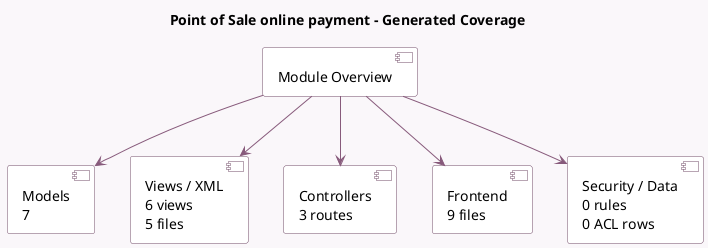

<!-- GENERATED:MODULE -->
---
tags: [odoo, community, module]
---

# Point of Sale online payment

- Scope: Community Addons
- Source: odoo/addons/pos_online_payment
- Dependencies: [[docs/Community Addons/point_of_sale/point_of_sale|point_of_sale]], [[docs/Community Addons/account_payment/account_payment|account_payment]]

## Generated coverage

- Models: 7
- XML files with UI/data artifacts: 5
- Views: 6
- Actions: 0
- Menus: 0
- Rules (ir.rule): 0
- Access CSV entries: 0
- Controller units: 1
- Frontend asset files: 9

## Module map

## Detail notes

- Models: [[docs/Community Addons/pos_online_payment/Models|Models]] (7)
- Views and XML: [[docs/Community Addons/pos_online_payment/Views|Views]] (5 files)
- Controllers: [[docs/Community Addons/pos_online_payment/Controllers|Controllers]] (1)
- Frontend: [[docs/Community Addons/pos_online_payment/Frontend|Frontend]] (9 files)

## Key models

- `account.payment`
- `payment.transaction`
- `pos.config`
- `pos.order`
- `pos.payment`
- `pos.payment.method`
- `pos.session`

## Navigation

- [[../Community Addons/Community Addons|Back to scope]]
- [[../../docs/docs|Back to docs]]

<!-- GENERATED:MODULE -->

