<!-- GENERATED:MODEL -->
---
tags: [odoo, community, generated, model]
---

# pos.order

- Module: [[docs/Community Addons/pos_restaurant/pos_restaurant|pos_restaurant]]
- Scope: Community Addons
- Defined in module: extension only
- Source files: `models/pos_order.py`
- Python classes: `PosOrder`

## Field footprint

- Detected fields: 3
- Field types: `Integer` x 1, `Many2one` x 1, `One2many` x 1
- Relation fields: 2

## Sample fields

- `course_ids`: `One2many` (comodel `restaurant.order.course`)
- `customer_count`: `Integer`
- `table_id`: `Many2one` (comodel `restaurant.table`)

## Method hints

- Detected methods: 2
- Action methods: none
- Compute methods: none
- Onchange methods: none

## Direct relation diagram

```plantuml
@startuml
!define ODOO_COLOR_PRIMARY #714B67
!define ODOO_COLOR_ACCENT #875A7B
!define ODOO_COLOR_BG #FAF7FA

skinparam backgroundColor ODOO_COLOR_BG
skinparam defaultTextAlignment left
skinparam ArrowColor ODOO_COLOR_ACCENT
skinparam ClassBackgroundColor white
skinparam ClassBorderColor ODOO_COLOR_PRIMARY
skinparam ComponentBackgroundColor white
skinparam ComponentBorderColor ODOO_COLOR_PRIMARY
skinparam NoteBackgroundColor #FFF8FF
skinparam NoteBorderColor ODOO_COLOR_ACCENT
skinparam SequenceLifeLineBorderColor ODOO_COLOR_ACCENT
skinparam SequenceLifeLineBackgroundColor #FFFFFF
skinparam SequenceParticipantBorderColor ODOO_COLOR_PRIMARY
skinparam SequenceParticipantBackgroundColor #FFFFFF
skinparam sequence {
  ArrowColor ODOO_COLOR_ACCENT
  ActorBorderColor ODOO_COLOR_PRIMARY
}
title pos.order - Direct Relations
class "pos.order" as pos_order
class "restaurant.order.course" as restaurant_order_course
class "restaurant.table" as restaurant_table
pos_order --> restaurant_table : table_id
pos_order --|> restaurant_order_course : course_ids
@enduml
```

## Navigation

- **Parent:** [[docs/Community Addons/pos_restaurant/Models]]

<!-- GENERATED:MODEL -->
