<!-- GENERATED:MODEL -->
---
tags: [odoo, community, generated, model]
---

# res.config.settings

- Module: [[docs/Community Addons/pos_restaurant/pos_restaurant|pos_restaurant]]
- Scope: Community Addons
- Defined in module: extension only
- Source files: `models/res_config_settings.py`
- Python classes: `ResConfigSettings`

## Field footprint

- Detected fields: 5
- Field types: `Boolean` x 3, `Many2many` x 1, `Selection` x 1
- Relation fields: 1

## Sample fields

- `pos_default_screen`: `Selection` (related `pos_config_id.default_screen`)
- `pos_floor_ids`: `Many2many` (related `pos_config_id.floor_ids`)
- `pos_iface_printbill`: `Boolean` (compute `_compute_pos_module_pos_restaurant`, store `True`)
- `pos_iface_splitbill`: `Boolean` (compute `_compute_pos_module_pos_restaurant`, store `True`)
- `pos_set_tip_after_payment`: `Boolean` (compute `_compute_pos_set_tip_after_payment`, store `True`)

## Method hints

- Detected methods: 2
- Action methods: none
- Compute methods: `_compute_pos_module_pos_restaurant`, `_compute_pos_set_tip_after_payment`
- Onchange methods: none

## Direct relation diagram

```plantuml
@startuml
!define ODOO_COLOR_PRIMARY #714B67
!define ODOO_COLOR_ACCENT #875A7B
!define ODOO_COLOR_BG #FAF7FA

skinparam backgroundColor ODOO_COLOR_BG
skinparam defaultTextAlignment left
skinparam ArrowColor ODOO_COLOR_ACCENT
skinparam ClassBackgroundColor white
skinparam ClassBorderColor ODOO_COLOR_PRIMARY
skinparam ComponentBackgroundColor white
skinparam ComponentBorderColor ODOO_COLOR_PRIMARY
skinparam NoteBackgroundColor #FFF8FF
skinparam NoteBorderColor ODOO_COLOR_ACCENT
skinparam SequenceLifeLineBorderColor ODOO_COLOR_ACCENT
skinparam SequenceLifeLineBackgroundColor #FFFFFF
skinparam SequenceParticipantBorderColor ODOO_COLOR_PRIMARY
skinparam SequenceParticipantBackgroundColor #FFFFFF
skinparam sequence {
  ArrowColor ODOO_COLOR_ACCENT
  ActorBorderColor ODOO_COLOR_PRIMARY
}
title res.config.settings - Direct Relations
class "res.config.settings" as res_config_settings
@enduml
```

## Navigation

- **Parent:** [[docs/Community Addons/pos_restaurant/Models]]

<!-- GENERATED:MODEL -->
