<!-- GENERATED:MODEL -->
---
tags: [odoo, community, generated, model]
---

# restaurant.floor

- Module: [[docs/Community Addons/pos_restaurant/pos_restaurant|pos_restaurant]]
- Scope: Community Addons
- Defined in module: yes
- Source files: `models/pos_restaurant.py`
- Python classes: `RestaurantFloor`
- Description: Restaurant Floor
- Inherits: `pos.load.mixin`

## Field footprint

- Detected fields: 8
- Field types: `Binary` x 1, `Boolean` x 1, `Char` x 2, `Image` x 1, `Integer` x 1, `Many2many` x 1, `One2many` x 1
- Relation fields: 2

## Sample fields

- `active`: `Boolean`
- `background_color`: `Char` (comodel `Background Color`)
- `background_image`: `Binary` (comodel `Background Image`)
- `floor_background_image`: `Image`
- `name`: `Char` (comodel `Floor Name`)
- `pos_config_ids`: `Many2many` (comodel `pos.config`)
- `sequence`: `Integer` (comodel `Sequence`)
- `table_ids`: `One2many` (comodel `restaurant.table`)

## Method hints

- Detected methods: 7
- Action methods: none
- Compute methods: none
- Onchange methods: none

## Direct relation diagram

```plantuml
@startuml
!define ODOO_COLOR_PRIMARY #714B67
!define ODOO_COLOR_ACCENT #875A7B
!define ODOO_COLOR_BG #FAF7FA

skinparam backgroundColor ODOO_COLOR_BG
skinparam defaultTextAlignment left
skinparam ArrowColor ODOO_COLOR_ACCENT
skinparam ClassBackgroundColor white
skinparam ClassBorderColor ODOO_COLOR_PRIMARY
skinparam ComponentBackgroundColor white
skinparam ComponentBorderColor ODOO_COLOR_PRIMARY
skinparam NoteBackgroundColor #FFF8FF
skinparam NoteBorderColor ODOO_COLOR_ACCENT
skinparam SequenceLifeLineBorderColor ODOO_COLOR_ACCENT
skinparam SequenceLifeLineBackgroundColor #FFFFFF
skinparam SequenceParticipantBorderColor ODOO_COLOR_PRIMARY
skinparam SequenceParticipantBackgroundColor #FFFFFF
skinparam sequence {
  ArrowColor ODOO_COLOR_ACCENT
  ActorBorderColor ODOO_COLOR_PRIMARY
}
title restaurant.floor - Direct Relations
class "restaurant.floor" as restaurant_floor
class "pos.config" as pos_config
class "restaurant.table" as restaurant_table
restaurant_floor .. pos_config : pos_config_ids
restaurant_floor --|> restaurant_table : table_ids
@enduml
```

## Navigation

- **Parent:** [[docs/Community Addons/pos_restaurant/Models]]

<!-- GENERATED:MODEL -->
