<!-- GENERATED:MODEL -->
---
tags: [odoo, community, generated, model]
---

# restaurant.table

- Module: [[docs/Community Addons/pos_restaurant/pos_restaurant|pos_restaurant]]
- Scope: Community Addons
- Defined in module: yes
- Source files: `models/pos_restaurant.py`
- Python classes: `RestaurantTable`
- Description: Restaurant Table
- Inherits: `pos.load.mixin`

## Field footprint

- Detected fields: 11
- Field types: `Boolean` x 1, `Char` x 1, `Float` x 4, `Integer` x 2, `Many2one` x 2, `Selection` x 1
- Relation fields: 2

## Sample fields

- `active`: `Boolean` (comodel `Active`)
- `color`: `Char` (comodel `Color`)
- `floor_id`: `Many2one` (comodel `restaurant.floor`)
- `height`: `Float` (comodel `Height`)
- `parent_id`: `Many2one` (comodel `restaurant.table`)
- `position_h`: `Float` (comodel `Horizontal Position`)
- `position_v`: `Float` (comodel `Vertical Position`)
- `seats`: `Integer` (comodel `Seats`)
- `shape`: `Selection`
- `table_number`: `Integer` (comodel `Table Number`)
- `width`: `Float` (comodel `Width`)

## Method hints

- Detected methods: 5
- Action methods: none
- Compute methods: `_compute_display_name`
- Onchange methods: none

## Direct relation diagram

```plantuml
@startuml
!define ODOO_COLOR_PRIMARY #714B67
!define ODOO_COLOR_ACCENT #875A7B
!define ODOO_COLOR_BG #FAF7FA

skinparam backgroundColor ODOO_COLOR_BG
skinparam defaultTextAlignment left
skinparam ArrowColor ODOO_COLOR_ACCENT
skinparam ClassBackgroundColor white
skinparam ClassBorderColor ODOO_COLOR_PRIMARY
skinparam ComponentBackgroundColor white
skinparam ComponentBorderColor ODOO_COLOR_PRIMARY
skinparam NoteBackgroundColor #FFF8FF
skinparam NoteBorderColor ODOO_COLOR_ACCENT
skinparam SequenceLifeLineBorderColor ODOO_COLOR_ACCENT
skinparam SequenceLifeLineBackgroundColor #FFFFFF
skinparam SequenceParticipantBorderColor ODOO_COLOR_PRIMARY
skinparam SequenceParticipantBackgroundColor #FFFFFF
skinparam sequence {
  ArrowColor ODOO_COLOR_ACCENT
  ActorBorderColor ODOO_COLOR_PRIMARY
}
title restaurant.table - Direct Relations
class "restaurant.table" as restaurant_table
class "restaurant.floor" as restaurant_floor
class "restaurant.table" as restaurant_table
restaurant_table --> restaurant_floor : floor_id
restaurant_table --> restaurant_table : parent_id
@enduml
```

## Navigation

- **Parent:** [[docs/Community Addons/pos_restaurant/Models]]

<!-- GENERATED:MODEL -->
