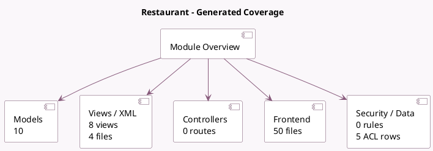

<!-- GENERATED:MODULE -->
---
tags: [odoo, community, module]
---

# Restaurant

- Scope: Community Addons
- Source: odoo/addons/pos_restaurant
- Dependencies: [[docs/Community Addons/point_of_sale/point_of_sale|point_of_sale]]

## Summary

Restaurant extensions for the Point of Sale 

## Generated coverage

- Models: 10
- XML files with UI/data artifacts: 4
- Views: 8
- Actions: 1
- Menus: 1
- Rules (ir.rule): 0
- Access CSV entries: 5
- Controller units: 0
- Frontend asset files: 50

## Module map

## Detail notes

- Models: [[docs/Community Addons/pos_restaurant/Models|Models]] (10)
- Views and XML: [[docs/Community Addons/pos_restaurant/Views|Views]] (4 files)
- Frontend: [[docs/Community Addons/pos_restaurant/Frontend|Frontend]] (50 files)

## Key models

- `pos.config`
- `pos.order`
- `pos.order.line`
- `pos.payment`
- `pos.preset`
- `pos.session`
- `res.config.settings`
- `restaurant.floor`
- `restaurant.order.course`
- `restaurant.table`

## Navigation

- [[../Community Addons/Community Addons|Back to scope]]
- [[../../docs/docs|Back to docs]]

<!-- GENERATED:MODULE -->

