<!-- GENERATED:MODEL -->
---
tags: [odoo, community, generated, model]
---

# pos.config

- Module: [[docs/Community Addons/pos_sale/pos_sale|pos_sale]]
- Scope: Community Addons
- Defined in module: extension only
- Source files: `models/pos_config.py`
- Python classes: `PosConfig`

## Field footprint

- Detected fields: 2
- Field types: `Many2one` x 2
- Relation fields: 2

## Sample fields

- `crm_team_id`: `Many2one` (comodel `crm.team`)
- `down_payment_product_id`: `Many2one` (comodel `product.product`)

## Method hints

- Detected methods: 3
- Action methods: none
- Compute methods: none
- Onchange methods: none

## Direct relation diagram

```plantuml
@startuml
!define ODOO_COLOR_PRIMARY #714B67
!define ODOO_COLOR_ACCENT #875A7B
!define ODOO_COLOR_BG #FAF7FA

skinparam backgroundColor ODOO_COLOR_BG
skinparam defaultTextAlignment left
skinparam ArrowColor ODOO_COLOR_ACCENT
skinparam ClassBackgroundColor white
skinparam ClassBorderColor ODOO_COLOR_PRIMARY
skinparam ComponentBackgroundColor white
skinparam ComponentBorderColor ODOO_COLOR_PRIMARY
skinparam NoteBackgroundColor #FFF8FF
skinparam NoteBorderColor ODOO_COLOR_ACCENT
skinparam SequenceLifeLineBorderColor ODOO_COLOR_ACCENT
skinparam SequenceLifeLineBackgroundColor #FFFFFF
skinparam SequenceParticipantBorderColor ODOO_COLOR_PRIMARY
skinparam SequenceParticipantBackgroundColor #FFFFFF
skinparam sequence {
  ArrowColor ODOO_COLOR_ACCENT
  ActorBorderColor ODOO_COLOR_PRIMARY
}
title pos.config - Direct Relations
class "pos.config" as pos_config
class "crm.team" as crm_team
class "product.product" as product_product
pos_config --> crm_team : crm_team_id
pos_config --> product_product : down_payment_product_id
@enduml
```

## Navigation

- **Parent:** [[docs/Community Addons/pos_sale/Models]]

<!-- GENERATED:MODEL -->
